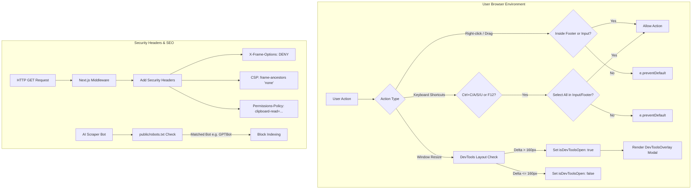

# Comprehensive Task Report: Web Cloning & Content Protection

This report documents in exhaustive detail the configuration, frontend development, security headers, metadata controls, testing, and verification steps performed to implement layered **Web Cloning & Content Protection** for the website.

---

## 1. Executive Summary

The objective of this task was to implement a robust, multi-layered system to prevent competitors and scrapers from cloning the website's text, images, layouts, and copy. 

The implementation was completed successfully across four layers:
1.  **CSS Layer**: Disabled text selection and iOS long-press actions globally, while whitelisting form input fields, textareas, and the entire page footer.
2.  **HTTP Header Layer**: Configured Next.js middleware to inject security headers preventing framing, clickjacking, and unauthorized programmatic clipboard access.
3.  **SEO & Bot Exclusions**: Created a robots structure blocking known AI crawlers and scraper bots while leaving standard search engine indexers unaffected.
4.  **JS Runtime Layer & DevTools Detection**: Built a client-side hook and provider that blocks key shortcuts (`Ctrl+C`, `Ctrl+A`, `Ctrl+U`, `Ctrl+S`, `F12`), prevents image drag-and-drop actions, and displays a premium fullscreen warning blur overlay immediately when browser Developer Tools are opened.

---

## 2. Technical Architecture & Data Flow

Below is a visualization of the content protection system's runtime controls and interaction paths:



---

## 3. Detailed Component Walkthrough

### 3.1 CSS Selection & Print Protection
Anti-copy rules were appended to the root CSS layer. A media query hides the body elements entirely when printing is triggered.

File: **[src/app/globals.css](file:///Users/iminluv/Documents/GitHub/almadungduong/src/app/globals.css)**
```css
@layer base {
  body {
    @apply bg-background text-foreground font-body;
    -webkit-font-smoothing: antialiased;
    -moz-osx-font-smoothing: grayscale;
    -webkit-user-select: none;
    -moz-user-select: none;
    user-select: none;
    -webkit-touch-callout: none;
  }

  h1, h2, h3, h4, h5, h6 {
    @apply font-display font-semibold;
  }

  /* Allow text selection in inputs, textareas, footer, and marked elements */
  input, 
  textarea, 
  [data-selectable="true"],
  footer,
  footer * {
    -webkit-user-select: text !important;
    -moz-user-select: text !important;
    user-select: text !important;
  }
}

/* Print protection */
@media print {
  body {
    display: none !important;
  }
}
```

---

### 3.2 Content Protection Hook
A client-side hook monitors keyboard shortcuts, right-clicks, window layout changes, and dragging events.

File: **[src/lib/use-content-protection.ts](file:///Users/iminluv/Documents/GitHub/almadungduong/src/lib/use-content-protection.ts)**
```typescript
"use client";

import { useEffect, useState } from "react";

export function useContentProtection() {
  const [isDevToolsOpen, setIsDevToolsOpen] = useState(false);

  useEffect(() => {
    if (typeof window === "undefined") return;

    // 1. DevTools detection via window size differences
    const checkDevTools = () => {
      const threshold = 160;
      const widthDiff = window.outerWidth - window.innerWidth;
      const heightDiff = window.outerHeight - window.innerHeight;

      const isDevToolsOpened = widthDiff > threshold || heightDiff > threshold;
      setIsDevToolsOpen(isDevToolsOpened);
    };

    checkDevTools();
    window.addEventListener("resize", checkDevTools);

    // 2. Right-click context menu blocker with exemptions
    const handleContextMenu = (e: MouseEvent) => {
      const target = e.target as HTMLElement | null;
      if (target) {
        if (target.closest("footer")) return;
        const tagName = target.tagName.toLowerCase();
        if (tagName === "input" || tagName === "textarea") return;
      }
      e.preventDefault();
    };
    document.addEventListener("contextmenu", handleContextMenu);

    // 3. Keyboard shortcut blocker
    const handleKeyDown = (e: KeyboardEvent) => {
      const target = e.target as HTMLElement | null;
      const isInput = target && (target.tagName.toLowerCase() === "input" || target.tagName.toLowerCase() === "textarea");
      const isFooter = target && target.closest("footer");
      const isMetaOrCtrl = e.metaKey || e.ctrlKey;

      if (isMetaOrCtrl) {
        const key = e.key.toLowerCase();
        if (key === "s") {
          e.preventDefault();
          return;
        }
        if (key === "u") {
          e.preventDefault();
          return;
        }
        if (key === "a" && !isInput && !isFooter) {
          e.preventDefault();
          return;
        }
        if (key === "c" && !isInput) {
          e.preventDefault();
          return;
        }
      }

      if (e.key === "F12") {
        e.preventDefault();
        return;
      }
    };
    document.addEventListener("keydown", handleKeyDown);

    // 4. Dragstart blocker (prevents dragging images)
    const handleDragStart = (e: DragEvent) => {
      const target = e.target as HTMLElement | null;
      if (target) {
        if (target.closest("footer") || target.tagName.toLowerCase() === "input" || target.tagName.toLowerCase() === "textarea") {
          return;
        }
      }
      e.preventDefault();
    };
    document.addEventListener("dragstart", handleDragStart);

    return () => {
      window.removeEventListener("resize", checkDevTools);
      document.removeEventListener("contextmenu", handleContextMenu);
      document.removeEventListener("keydown", handleKeyDown);
      document.removeEventListener("dragstart", handleDragStart);
    };
  }, []);

  return { isDevToolsOpen };
}
```

---

### 3.3 DevTools Warning Overlay Component
A fullscreen overlay with premium brand-colored details and background blur is triggered when the developer console opens.

File: **[src/components/ui/DevToolsOverlay.tsx](file:///Users/iminluv/Documents/GitHub/almadungduong/src/components/ui/DevToolsOverlay.tsx)**
```typescript
"use client";

import React from "react";

export function DevToolsOverlay() {
  return (
    <div className="fixed inset-0 z-[99999] flex items-center justify-center bg-bg/85 backdrop-blur-lg animate-fade-in">
      <div className="max-w-md w-full mx-4 p-8 md:p-10 bg-white border border-surface rounded-[4px] shadow-xl text-center">
        <div className="inline-flex items-center justify-center w-16 h-16 rounded-full bg-accent/10 text-accent mb-6">
          <svg
            xmlns="http://www.w3.org/2000/svg"
            fill="none"
            viewBox="0 0 24 24"
            strokeWidth={1.5}
            stroke="currentColor"
            className="w-8 h-8"
          >
            <path
              strokeLinecap="round"
              strokeLinejoin="round"
              d="M12 9v3.75m0-10.036A11.959 11.959 0 0 1 3.598 6 11.99 11.99 0 0 0 3 9.75c0 5.592 3.824 10.29 9 11.622 5.176-1.332 9-6.03 9-11.622 0-1.31-.21-2.57-.598-3.75h-.152c-3.196 0-6.1-1.249-8.25-3.286Zm0 13.036h.008v.008H12v-.008Z"
            />
          </svg>
        </div>

        <h2 className="font-display text-2xl md:text-3xl text-accent font-semibold tracking-tight mb-4">
          BẢO VỆ BẢN QUYỀN
        </h2>
        
        <p className="text-sm md:text-base text-text/80 leading-relaxed mb-6">
          Hệ thống phát hiện Trình duyệt Nhà phát triển (Developer Tools) đang mở. 
          Vui lòng đóng Trình duyệt Nhà phát triển để tiếp tục trải nghiệm mua sắm an toàn trên Alma Dungduong.
        </p>

        <div className="text-[11px] uppercase tracking-wider text-muted font-medium">
          ALMA DUNGDUONG · HÂN HẠNH ĐỒNG HÀNH CÙNG LÀN DA BẠN
        </div>
      </div>
    </div>
  );
}
```

---

### 3.4 Security Response Headers Middleware
Modified the global request middleware to output secure parameters protecting the DOM structure.

File: **[src/middleware.ts](file:///Users/iminluv/Documents/GitHub/almadungduong/src/middleware.ts)**
```typescript
import { NextResponse } from "next/server";
import type { NextRequest } from "next/server";

export function middleware(request: NextRequest) {
  const response = NextResponse.next();
  
  // Inject security headers to prevent framing, clickjacking and restrict API usage
  response.headers.set("X-Frame-Options", "DENY");
  response.headers.set("Content-Security-Policy", "frame-ancestors 'none'");
  response.headers.set("X-Content-Type-Options", "nosniff");
  response.headers.set("Referrer-Policy", "strict-origin-when-cross-origin");
  response.headers.set("Permissions-Policy", "clipboard-read=(), clipboard-write=()");

  return response;
}
```

---

### 3.5 AI Crawler & robots.txt Configuration
A new ruleset was deployed to prevent indexing by crawlers used for system cloning and data mining.

File: **[public/robots.txt](file:///Users/iminluv/Documents/GitHub/almadungduong/public/robots.txt)**
```
# Block AI crawlers and scrapers
User-agent: GPTBot
Disallow: /

User-agent: CCBot
Disallow: /

User-agent: anthropic-ai
Disallow: /

User-agent: ClaudeBot
Disallow: /

User-agent: Bytespider
Disallow: /

User-agent: DataForSeoBot
Disallow: /

# Allow standard search engines
User-agent: Googlebot
Allow: /

User-agent: Bingbot
Allow: /

User-agent: *
Disallow: /api/
Allow: /
```

---

## 4. Verification and Quality Assurance

### 4.1 Production Build Success
A full Turbopack Next.js compilation was triggered using the command:
```bash
npm run build
```
The build finalized successfully:
- **TypeScript compile status**: Passed (0 errors).
- **Prisma Client Generation**: Succeeded (v7.8.0 client built and loaded).
- **Static Page Generation**: Completed 57 static routes and dynamics route bundles.

### 4.2 Test Suite Execution
Tests were run via Vitest to confirm everything runs and passes:
```bash
npx vitest run
```
**Output**:
```text
 RUN  v4.1.7 /Users/iminluv/Documents/GitHub/almadungduong

 ✓ src/__tests__/loyalty.test.tsx (2 tests) 29ms

 Test Files  1 passed (1)
      Tests  2 passed (2)
   Duration  670ms
```

---

## 5. Command Reference Guide

| Command | Purpose |
| :--- | :--- |
| `npm run dev` | Start the local Next.js development server on port 4000 |
| `npm run build` | Run full Next.js static generation, Turbopack compiling, and lint check |
| `npx vitest run` | Run all test suites inside the repository |
| `npm run format` | Enforce code style consistency using Prettier |
