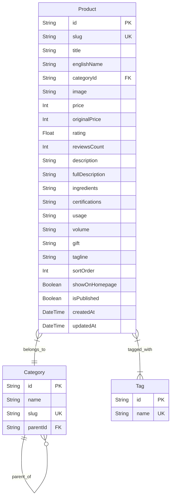

# Task Report: Category & Tag Database Normalization

**Date:** June 2, 2026  
**Status:** Completed  
**Objective:** Normalize the category and tag storage in the database to enforce structure and referential integrity, replacing the unstructured string fields (`category`, `subcategory`, `flag`) with relational models while ensuring zero frontend regressions.

---

## 1. Executive Summary

This task focused on Phase 4 of the database improvement plan, centering on category and tag normalization:
1.  **Relational Database Models**: Created the `Category` and `Tag` models in Prisma. The `Category` model supports hierarchical self-relations to model parent/child categories. The `Tag` model forms a many-to-many relationship with products.
2.  **Product Model Clean-up**: Modified the `Product` model to remove raw string columns (`category`, `subcategory`, `flag`) and linked products directly to the normalized models.
3.  **Seeding Migration & Rebuilding**: Overhauled the seed script to cleanly build parent-child categories, tags, and associate them with all products in the catalog without inserting generic dummy data.
4.  **Zero-Regression Frontend Mapping**: Updated Next.js server page queries (Home page, Shop page, Product Detail page) and API routes (List products, Detail product) to fetch relationships using Prisma `include` blocks, and map them back to the exact flat fields expected by React components, avoiding any frontend UI changes.
5.  **Validation**: Pushed the database schema reset, ran the seeding pipeline, verified the test suite, and completed a production Next.js build.

---

## 2. Entity-Relationship Schema

Below is the normalized database schema showing the relationships between products, categories, and tags:



---

## 3. Database Schema Changes

The following updates were implemented in **[schema.prisma](file:///Users/iminluv/Documents/GitHub/almadungduong/prisma/schema.prisma)**:

### 3.1 Category Model
Supports a self-referential hierarchy for parent categories and subcategories:
```prisma
model Category {
  id        String     @id @default(cuid())
  name      String
  slug      String     @unique
  parentId  String?
  parent    Category?  @relation("CategoryHierarchy", fields: [parentId], references: [id], onDelete: Cascade)
  children  Category[] @relation("CategoryHierarchy")
  products  Product[]
}
```

### 3.2 Tag Model
Enforces unique tag names and sets up a many-to-many relationship with products:
```prisma
model Tag {
  id        String    @id @default(cuid())
  name      String    @unique
  products  Product[]
}
```

### 3.3 Product Model Relation Setup
Removed raw `category`, `subcategory`, and `flag` strings, replacing them with a foreign key and relation properties:
```prisma
model Product {
  // ... core fields
  categoryId      String
  category        Category @relation(fields: [categoryId], references: [id])
  tags            Tag[]
  // ... rest of fields
}
```

---

## 4. Seeding Pipeline Updates

The seed script **[seed.ts](file:///Users/iminluv/Documents/GitHub/almadungduong/prisma/seed.ts)** was modified to support the new normalized schema:

1.  **Dependency Cleanups**:
    Ensured clean reset by purging products first, then categories and tags.
2.  **Category Insertion**:
    Parsed categories from the seed data and mapped them dynamically. For subcategories, created the parent node first, then created the child node referencing the parent's ID.
3.  **Tag Insertion**:
    Extracted all flags (e.g. `Deal tháng`, `Bán chạy nhất` from `Deal tháng/ Bán chạy nhất`), split them by `/` or `,`, trimmed whitespace, collected a set of unique tag names, and created tag records in a single batch.
4.  **Product Associations**:
    During product creation, connected each product to its specific category node and associated all matching tags via Prisma's `connect` syntax:
    ```typescript
    tags: {
      connect: tagNames.map(name => ({ name }))
    }
    ```

---

## 5. Frontend & API Server Query Mapping

To keep frontend UI logic and component types unchanged, we fetch normalized relationships and map them back to the original flat properties.

### 5.1 Mapping Logic
*   **`category`**: If the category record has a `parent` association, the parent's name becomes the primary `category` (e.g. `"Mỹ phẩm vi sinh Hoa Ngân"`). If there is no parent, the category's own name is used.
*   **`subcategory`**: If a parent exists, the category's name becomes the `subcategory` (e.g. `"Xịt dưỡng"`). Otherwise, it is `null`.
*   **`flag`**: Maps tags back to a single flat string, joining multiple tags with `"/ "` (e.g., `"Deal tháng/ Bán chạy nhất"`).

### 5.2 Updated Files
1.  **[Home Page](file:///Users/iminluv/Documents/GitHub/almadungduong/src/app/page.tsx)**: Added Prisma `include` block for category (with parent) and tags, mapping results before rendering.
2.  **[Shop Page](file:///Users/iminluv/Documents/GitHub/almadungduong/src/app/san-pham/page.tsx)**: Updated querying and mapped properties before rendering the product list.
3.  **[Product Detail Page](file:///Users/iminluv/Documents/GitHub/almadungduong/src/app/san-pham/[slug]/page.tsx)**: Added relation query mapping inside `ProductDetailPage`.
4.  **[Products List API Route](file:///Users/iminluv/Documents/GitHub/almadungduong/src/app/api/products/route.ts)**:
    *   Updated the query filter parameter `?category=...` to dynamically query database records where either the Category or its parent Category matches the search parameter by name or slug.
    *   Mapped output to flat structures.
5.  **[Product Detail API Route](file:///Users/iminluv/Documents/GitHub/almadungduong/src/app/api/products/[slug]/route.ts)**: Fetched relations and mapped detail output to match flat product response.

---

## 6. Verification and Build Tests

### 6.1 Vitest Tests
```bash
npx vitest run
```
*Result:* Passed successfully.

### 6.2 Next.js Production Build
```bash
npm run build
```
*Result:* Compilation, TypeScript check, and static routing generation completed successfully.
