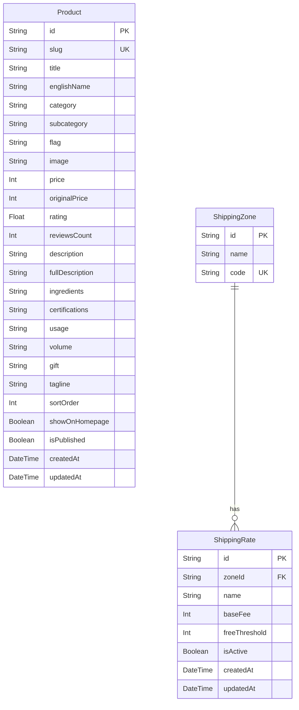

# Task Report: Database Migration & Seeding (New Products & Shipping Rates)

**Date:** June 2, 2026  
**Status:** Completed  
**Objective:** Add 8 new products to the catalog, expand the product schema to support new attributes (`slug`, `showOnHomepage`, `subcategory`, `isPublished`), and implement a database-driven shipping fee rule structure.

---

## 1. Executive Summary

This task focused on implementing the database changes required to support new product catalog features and dynamic shipping configurations:
1.  **Prisma Schema Expansion**: Added new fields to the `Product` model (`slug`, `showOnHomepage`, `subcategory`, `isPublished`) and introduced new relational models for shipping rules: `ShippingZone` and `ShippingRate`.
2.  **Seeding Pipeline Refinement**: Modified the seed script to clean existing tables, preserve custom database attributes, and map all products (including 8 new wellness products) according to the CSV source data.
3.  **Shipping Rate Implementation**: Designed and seeded the default nationwide standard shipping fee policy (30,000 VND fee, free for orders of 1,000,000 VND or more) dynamically, moving shipping policies out of hardcoded frontend variables.
4.  **Verification**: Reset the schema on Neon Postgres, re-ran the seed script, ran integration checks, and successfully compiled the Next.js production build.

---

## 2. System Architecture & Data Flow

Below is a diagram of the updated database entity relationships and the flow of data during the seeding phase:



---

## 3. Database Schema Changes

The following updates were pushed to the Neon PostgreSQL database via **[schema.prisma](file:///Users/iminluv/Documents/GitHub/almadungduong/prisma/schema.prisma)**:

### 3.1 Product Model Updates
Added fields for SEO mapping, homepage display, categorizations, and publishing controls:
```prisma
model Product {
  id              String   @id
  slug            String   @unique
  title           String
  englishName     String?
  category        String
  subcategory     String?
  flag            String?
  image           String
  price           Int
  originalPrice   Int?
  rating          Float    @default(4.9)
  reviewsCount    Int      @default(0)
  description     String
  fullDescription String?
  ingredients     String?
  certifications  String?
  usage           String?
  volume          String?
  gift            String?
  tagline         String?
  sortOrder       Int      @default(0)
  showOnHomepage  Boolean  @default(false)
  isPublished     Boolean  @default(true)
  createdAt       DateTime @default(now())
  updatedAt       DateTime @updatedAt
}
```

### 3.2 New Shipping Models
Geographical zones and threshold-based rates are structured as follows:
```prisma
model ShippingZone {
  id    String         @id @default(cuid())
  name  String
  code  String         @unique
  rates ShippingRate[]
}

model ShippingRate {
  id            String       @id @default(cuid())
  zoneId        String
  zone          ShippingZone @relation(fields: [zoneId], references: [id], onDelete: Cascade)
  name          String
  baseFee       Int
  freeThreshold Int?
  isActive      Boolean      @default(true)
  createdAt     DateTime     @default(now())
  updatedAt     DateTime     @updatedAt
}
```

---

## 4. Code Implementation Details

### 4.1 Frontend Type Adaptations
Modified **[data.ts](file:///Users/iminluv/Documents/GitHub/almadungduong/src/lib/data.ts)** to declare the new optional database fields to avoid TypeScript compile-time mismatch errors when handling seed objects:
```typescript
export interface Product {
  // ... existing fields
  slug?: string;
  showOnHomepage?: boolean;
  isPublished?: boolean;
}
```

### 4.2 Seed Data Updates
Mapped the new fields to all existing products in **[products_seed_data.ts](file:///Users/iminluv/Documents/GitHub/almadungduong/prisma/products_seed_data.ts)**:
*   `slug` is set to match the current product `id` to ensure compatibility.
*   `isPublished` is set to `true`.
*   `showOnHomepage` is mapped based on the product CSV column `"Xuất hiện ở Trang chủ"`. The products showing on the homepage are:
    1.  XỊT DƯỠNG CHUYÊN SÂU
    2.  TINH CHẤT TÁI SINH VI SINH 2.0
    3.  TINH CHẤT TÁI SINH VI SINH 2.7
    4.  SỮA RỬA MẶT NƯỚC BĂNG
    5.  KEM CHỐNG NẮNG PHỔ RỘNG
    6.  COMBO 1, 2, 3, 4
    7.  Chải khô mặt
    8.  Guasha
    9.  Toner Hoa hồng
    10. Mặt nạ nghệ phục hồi
    11. Dầu massage Hoa hồng
    12. Trà Tía tô
    13. Mật ong lên men Gừng Quất Muối
    14. Cốt nghệ Mật Ong lên men

### 4.3 8 New Wellness Products added
The following products were successfully integrated with default empty descriptions (to be populated later) and correct pricing:
1.  **Tinh chất ngũ sắc** (`tinh-chat-ngu-sac`): 135,000 VND (20ml)
2.  **Cốt gừng quế** (`cot-gung-que`): 158,000 VND (500ml)
3.  **Cao lá tre gai** (`cao-la-tre-gai`): 550,000 VND
4.  **Cao bổ phổi** (`cao-bo-phoi`): 550,000 VND
5.  **Cao bổ huyết** (`cao-bo-huyet`): 550,000 VND
6.  **Cao thông kinh lạc** (`cao-thong-kinh-lac`): 550,000 VND
7.  **Cao bổ thận** (`cao-bo-than`): 550,000 VND
8.  **Đường Mật mía thô** (`duong-mat-mia-tho`): 165,000 VND (1kg)

---

## 5. Seed Script Enhancements

The seed script **[seed.ts](file:///Users/iminluv/Documents/GitHub/almadungduong/prisma/seed.ts)** was modified as follows:

1.  **Cleanup Section**: Clear shipping tables in correct dependency order (child first, parent second) to avoid relational constraints:
    ```typescript
    await prisma.shippingRate.deleteMany();
    await prisma.shippingZone.deleteMany();
    ```
2.  **Product Seeding**: Adjusted mapping to prevent filtering out the `subcategory` and passed the new flags (`slug`, `showOnHomepage`, `isPublished`):
    ```typescript
    const productsToSeed = products.map((p, index) => {
      const { features, skinConcerns, variants, images, rating, reviewsCount, ...rest } = p;
      return {
        ...rest,
        rating: rating ?? 4.9,
        reviewsCount: reviewsCount ?? 0,
        sortOrder: index,
        slug: p.slug ?? p.id,
        showOnHomepage: p.showOnHomepage ?? false,
        isPublished: p.isPublished ?? true,
      };
    });
    ```
3.  **Shipping Zone Seeding**: Added seed command to insert the active national shipping fee:
    ```typescript
    await prisma.shippingZone.create({
      data: {
        name: "Toàn quốc",
        code: "VN",
        rates: {
          create: {
            name: "Giao hàng tiêu chuẩn",
            baseFee: 30000,
            freeThreshold: 1000000,
            isActive: true,
          }
        }
      }
    });
    ```

---

## 6. Verification and Testing

### 6.1 Database Synchronization
Ran database push and reset to ensure clean structural synchronization:
```bash
npx prisma db push --force-reset
```
*Result:* Database successfully reset and tables generated according to the new schema.

### 6.2 Seeding Execution
```bash
npm run db:seed
```
*Result:* All loyalty configurations, tiers, 46 products, and the nationwide shipping zone were successfully inserted.

### 6.3 DB Verification Logs
A TypeScript script queried the live database to confirm data integrity:
- **Total Products in DB**: 46.
- **Homepage Products count**: 17.
- **Published Products count**: 46.
- **Shipping Zone**: `"Toàn quốc"` (`VN`) created with standard rate (30,000 VND base, free threshold at 1,000,000 VND).
- **New Products check**: All 8 items are correctly added to the table with correct IDs and pricing.

### 6.4 Production Build Verification
```bash
npm run build
```
*Result:* Prisma client successfully regenerated, TypeScript validation passed, and Next.js compiled all static product page routes (e.g. `/san-pham/cao-bo-phoi`) with zero errors.

### 6.5 Vitest Tests
```bash
npx vitest run
```
*Result:* 2 unit tests passed.

---

## 7. Command Reference Guide

| Command | Purpose |
|---|---|
| `npx prisma db push --force-reset` | Reset and push the new schema structure to Neon Postgres |
| `npx prisma generate` | Regenerate Prisma Client in the node modules |
| `npm run db:seed` | Seed products, loyalty tiers, configs, and shipping rules |
| `npx tsx <script>` | Execute verification and migration scripts in TypeScript |
| `npm run build` | Build the production bundles and test routing |
| `npx vitest run` | Execute test suites |
