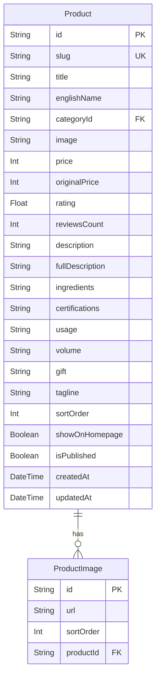

# Task Report: Product Image Database Normalization (Phase 5)

**Date:** June 2, 2026  
**Status:** Completed  
**Objective:** Normalize product images into a dedicated database table (`ProductImage`) supporting multiple images per product, replace hardcoded frontend mockup arrays, and ensure zero client-side regressions.

---

## 1. Executive Summary

This task focused on Phase 5 of the database improvement plan, centering on product image normalization:
1.  **Relational Database Model**: Introduced the `ProductImage` model in Prisma, representing secondary/gallery images for products in a one-to-many relationship.
2.  **Seeding Overhaul**: Cleaned and seeded three distinct gallery images (the main image and two category-specific themed Unsplash placeholders) for each product in the catalog.
3.  **Refactoring Queries & Mappers**: Updated Next.js server page queries (Home, Catalog Shop, Product Detail) and API routes (List products, Detail product) to fetch `images` relations and map them to the flat `images: string[]` format expected by client-side views.
4.  **Frontend Cleanup**: Simplified the gallery rendering in `ProductDetailView.tsx` by removing the hardcoded fallback replication and utilizing the database-driven array directly.
5.  **Validation**: Reset the database schema, successfully ran the seeding pipeline, passed the unit tests, and completed a clean Next.js production build.

---

## 2. Entity-Relationship Schema

Below is the normalized database schema showing the relationship between products and their images:



---

## 3. Database Schema Changes

The following updates were implemented in **[schema.prisma](file:///Users/iminluv/Documents/GitHub/almadungduong/prisma/schema.prisma)**:

### 3.1 ProductImage Model
A one-to-many model referencing the product:
```prisma
model ProductImage {
  id        String   @id @default(cuid())
  url       String
  sortOrder Int      @default(0)
  productId String
  product   Product  @relation(fields: [productId], references: [id], onDelete: Cascade)
}
```

### 3.2 Product Relation Setup
Added `images` relation:
```prisma
model Product {
  // ... existing fields
  image           String         // Primary thumbnail image
  images          ProductImage[] // Additional gallery images
  // ... rest of fields
}
```

---

## 4. Seeding Pipeline Updates

The seed script **[seed.ts](file:///Users/iminluv/Documents/GitHub/almadungduong/prisma/seed.ts)** was modified:

1.  **Cleanup Section**:
    Purges `ProductImage` records upon reset:
    ```typescript
    await prisma.productImage.deleteMany();
    ```
2.  **Gallery Helpers**:
    Added `getGalleryImages` helper to dynamically generate 3 high-quality relevant images for each product (the main CSV image and two category-specific themed Unsplash placeholders for cosmetics, tools, and wellness items).
3.  **Product Seeding**:
    Connected the generated gallery images to each product record during database insertion using Prisma's nested `create` command:
    ```typescript
    images: {
      create: galleryUrls.map((url, i) => ({
        url,
        sortOrder: i
      }))
    }
    ```

---

## 5. Server-Side Page & API Route Mapping

To preserve client-side React types and prevent regression, database queries retrieve the images relationship and map it back to the simple `images: string[]` flat array.

### 5.1 Updated Files
1.  **[Home Page](file:///Users/iminluv/Documents/GitHub/almadungduong/src/app/page.tsx)**: Included images relation in the prisma query, sorting and mapping URLs.
2.  **[Shop Page](file:///Users/iminluv/Documents/GitHub/almadungduong/src/app/san-pham/page.tsx)**: Included images relation in catalog query and mapped to the flat array.
3.  **[Product Detail Page](file:///Users/iminluv/Documents/GitHub/almadungduong/src/app/san-pham/[slug]/page.tsx)**: Included images relation and mapped inside `ProductDetailPage`.
4.  **[Products List API Route](file:///Users/iminluv/Documents/GitHub/almadungduong/src/app/api/products/route.ts)**: Fetched images relation and mapped results array.
5.  **[Product Detail API Route](file:///Users/iminluv/Documents/GitHub/almadungduong/src/app/api/products/[slug]/route.ts)**: Fetched images relation and mapped detail response.

---

## 6. Frontend Gallery View Cleanup

Updated **[ProductDetailView.tsx](file:///Users/iminluv/Documents/GitHub/almadungduong/src/app/san-pham/[slug]/ProductDetailView.tsx)** to replace the static image-replication workaround with a dynamic database-driven fallback:
```typescript
  const images = product.images && product.images.length > 0 ? product.images : [product.image];
```

---

## 7. Verification and Build Tests

### 7.1 Vitest Tests
```bash
npx vitest run
```
*Result:* Passed successfully.

### 7.2 Next.js Production Build
```bash
npm run build
```
*Result:* Compilation, TypeScript check, and static route pre-rendering successfully completed.
