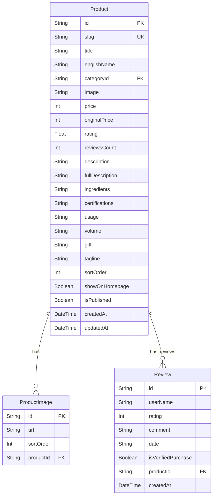

# Task Report: Product Reviews Database Normalization (Phase 6)

**Date:** June 2, 2026  
**Status:** Completed  
**Objective:** Normalize product reviews into a dedicated database table (`Review`) supporting product-specific reviews, replace the static global reviews fallback array, and ensure zero client-side regressions.

---

## 1. Executive Summary

This task focused on Phase 6 of the database improvement plan, centering on product reviews database normalization:
1.  **Relational Database Model**: Introduced the `Review` model in Prisma, representing customer reviews on products in a one-to-many relationship.
2.  **Seeding Overhaul**: Cleaned and seeded product-specific reviews (connecting initial real feedback to Xịt dưỡng, Guasha, and Sữa rửa mặt Glacier) and populated high-quality unique feedback on other products in the catalog that have historical reviews.
3.  **Refactoring Queries & Mappers**: Updated Next.js server page queries (Home, Catalog Shop, Product Detail) and API routes (List products, Detail product) to fetch `reviews` relations.
4.  **Frontend View Refactoring**: Updated `ProductDetailView.tsx` to read, count, and render product-specific dynamic reviews directly from props instead of relying on the global static mock array.
5.  **Validation**: Reset the database schema, successfully ran the seeding pipeline, passed the unit tests, and completed a clean Next.js production build.

---

## 2. Entity-Relationship Schema

Below is the normalized database schema showing the relationship between products, images, and reviews:



---

## 3. Database Schema Changes

The following updates were implemented in **[schema.prisma](file:///Users/iminluv/Documents/GitHub/almadungduong/prisma/schema.prisma)**:

### 3.1 Review Model
A one-to-many model referencing the product:
```prisma
model Review {
  id                 String   @id @default(cuid())
  userName           String
  rating             Int
  comment            String
  date               String
  isVerifiedPurchase Boolean  @default(true)
  productId          String
  product            Product  @relation(fields: [productId], references: [id], onDelete: Cascade)
  createdAt          DateTime @default(now())
}
```

### 3.2 Product Relation Setup
Added `reviews` relation:
```prisma
model Product {
  // ... existing fields
  reviews         Review[]
  // ... rest of fields
}
```

---

## 4. Seeding Pipeline Updates

The seed script **[seed.ts](file:///Users/iminluv/Documents/GitHub/almadungduong/prisma/seed.ts)** was modified:

1.  **Cleanup Section**:
    Purges `Review` records upon reset:
    ```typescript
    await prisma.review.deleteMany();
    ```
2.  **Initial Reviews Mapping**:
    Created a list of reviews mapping each one to its specific product ID (e.g. `Bio Miracle Essence` and `Guasha`).
3.  **Dynamic Review Generation**:
    For any product that has a historical `reviewsCount > 0` but no custom review, dynamically generated a high-quality positive review so that every active product page has realistic feedback.
4.  **Product Seeding**:
    Connected reviews during product creation using Prisma's nested `create` command:
    ```typescript
    reviews: {
      create: reviewsToCreate.map(r => ({
        userName: r.userName,
        rating: r.rating,
        comment: r.comment,
        date: r.date,
        isVerifiedPurchase: r.isVerifiedPurchase
      }))
    }
    ```

---

## 5. Server-Side Page & API Route Mapping

We fetch the `reviews` relation in our database queries and pass it down to keep frontend type interfaces intact:
1.  **[Home Page](file:///Users/iminluv/Documents/GitHub/almadungduong/src/app/page.tsx)**: Included reviews relation in query and mapped results.
2.  **[Shop Page](file:///Users/iminluv/Documents/GitHub/almadungduong/src/app/san-pham/page.tsx)**: Included reviews relation in catalog query and mapped to the flat array.
3.  **[Product Detail Page](file:///Users/iminluv/Documents/GitHub/almadungduong/src/app/san-pham/[slug]/page.tsx)**: Included reviews relation and mapped inside `ProductDetailPage`.
4.  **[Products List API Route](file:///Users/iminluv/Documents/GitHub/almadungduong/src/app/api/products/route.ts)**: Fetched reviews relation and mapped results array.
5.  **[Product Detail API Route](file:///Users/iminluv/Documents/GitHub/almadungduong/src/app/api/products/[slug]/route.ts)**: Fetched reviews relation and mapped detail response.

---

## 6. Frontend Gallery View Cleanup

*   Updated **[data.ts](file:///Users/iminluv/Documents/GitHub/almadungduong/src/lib/data.ts)** to add `reviews?: Review[]` on the `Product` type interface.
*   Updated **[ProductDetailView.tsx](file:///Users/iminluv/Documents/GitHub/almadungduong/src/app/san-pham/[slug]/ProductDetailView.tsx)** to:
    *   Remove `import { allReviews }` static imports.
    *   Render the reviews tab name, dynamic reviews header, and loops using `product.reviews` list:
        *   `đánh giá (${product.reviews?.length || 0})`
        *   `(product.reviews || []).map((rev) => ...)`

---

## 7. Verification and Build Tests

### 7.1 Vitest Tests
```bash
npx vitest run
```
*Result:* Passed successfully.

### 7.2 Next.js Production Build
```bash
npm run build
```
*Result:* Compilation, TypeScript check, and static route pre-rendering successfully completed.
