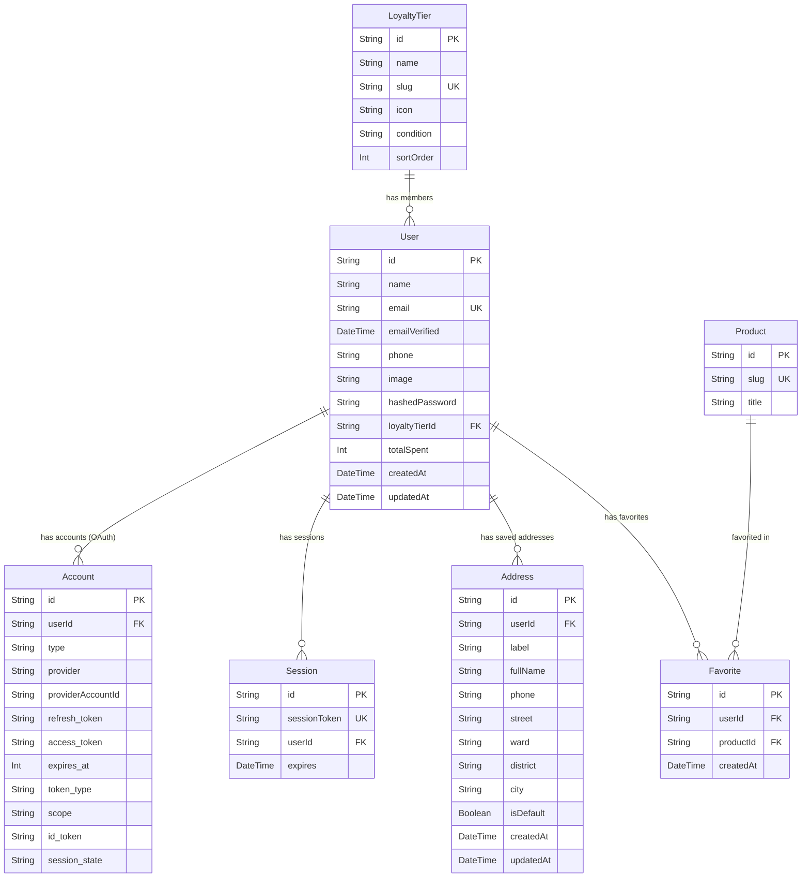

# Task Report: User Account Feature - Phase 1 & 2 (Dependencies, Environment & Database Schema)

**Date:** June 4, 2026  
**Status:** Completed  
**Objective:** Add all authentication dependencies, configure the NextAuth secret and Google OAuth placeholders in the environment, extend the Prisma schema with user auth models, and synchronize the schema with the Neon PostgreSQL database.

---

## 1. Executive Summary

In this initial phase of the User Account feature, we established the infrastructure foundation:
1. **Dependencies Added**: Installed NextAuth (v5 beta) and `bcryptjs` (plus TypeScript typings) to handle OAuth and credentials-based authentication.
2. **Environment Configuration**: Generated a secure NextAuth cryptographic secret via openssl and prepared environment configurations for Google Cloud Console integration.
3. **Database Schema Expansion**: Defined 5 new database models (`User`, `Account`, `Session`, `Address`, `Favorite`) and configured relationships to the existing `LoyaltyTier` and `Product` tables.
4. **Database Migration & Sync**: Synchronized the new schema definitions to the live Neon PostgreSQL database using `prisma db push` and successfully generated the updated Prisma client.

---

## 2. Database Schema & Architecture

Below is the entity relationship diagram showing how the new user account and authentication tables link to the existing database design:



---

## 3. Implementation Details

### 3.1 Dependencies Added
The following libraries were successfully installed via `npm`:
* **`next-auth` (v5.0.0-beta.30)**: NextAuth.js framework integration.
* **`bcryptjs` (v3.0.0)** & **`@types/bcryptjs` (v2.4.6)**: Password hashing security library.

### 3.2 Environment Updates
We updated the root **[.env](file:///Users/iminluv/Documents/GitHub/almadungduong/.env)**:
* Set `NEXTAUTH_SECRET` to a cryptographically secure 32-byte key generated via `openssl rand -base64 32`.
* Added placeholder variables `GOOGLE_CLIENT_ID` and `GOOGLE_CLIENT_SECRET` for the user to configure.

### 3.3 Prisma Schema Definitions
Modified **[schema.prisma](file:///Users/iminluv/Documents/GitHub/almadungduong/prisma/schema.prisma)** with the following models:

#### User Table
```prisma
model User {
  id              String    @id @default(cuid())
  name            String?
  email           String    @unique
  emailVerified   DateTime?
  phone           String?
  image           String?
  hashedPassword  String?                // null for Google-only users
  loyaltyTierId   String?
  loyaltyTier     LoyaltyTier? @relation(fields: [loyaltyTierId], references: [id])
  totalSpent      Int       @default(0)  // accumulated spend → auto tier upgrade
  accounts        Account[]
  sessions        Session[]
  addresses       Address[]
  favorites       Favorite[]
  createdAt       DateTime  @default(now())
  updatedAt       DateTime  @updatedAt
}
```

#### Account (OAuth) & Session Tables
```prisma
model Account {
  id                String  @id @default(cuid())
  userId            String
  user              User    @relation(fields: [userId], references: [id], onDelete: Cascade)
  type              String
  provider          String
  providerAccountId String
  refresh_token     String?
  access_token      String?
  expires_at        Int?
  token_type        String?
  scope             String?
  id_token          String?
  session_state     String?
  @@unique([provider, providerAccountId])
}

model Session {
  id           String   @id @default(cuid())
  sessionToken String   @unique
  userId       String
  user         User     @relation(fields: [userId], references: [id], onDelete: Cascade)
  expires      DateTime
}
```

#### Address CRUD Table
```prisma
model Address {
  id          String   @id @default(cuid())
  userId      String
  user        User     @relation(fields: [userId], references: [id], onDelete: Cascade)
  label       String   @default("Nhà")
  fullName    String
  phone       String
  street      String
  ward        String?
  district    String
  city        String
  isDefault   Boolean  @default(false)
  createdAt   DateTime @default(now())
  updatedAt   DateTime @updatedAt
}
```

#### Favorite Wishlist Table
```prisma
model Favorite {
  id        String   @id @default(cuid())
  userId    String
  user      User     @relation(fields: [userId], references: [id], onDelete: Cascade)
  productId String
  product   Product  @relation(fields: [productId], references: [id], onDelete: Cascade)
  createdAt DateTime @default(now())
  @@unique([userId, productId])
}
```

#### Existing Model Enhancements
1. **`LoyaltyTier`**: Added `users User[]` relation.
2. **`Product`**: Added `favorites Favorite[]` relation.

---

## 4. Verification and Database Sync

1. **Schema Check & Sync**: Run schema push to sync the Neon DB:
   ```bash
   npx prisma db push
   ```
   *Result:* Database successfully synchronized with the 5 new tables and 2 updated tables. No data was lost.
2. **Prisma Client Generation**:
   ```bash
   npx prisma generate
   ```
   *Result:* Prisma Client generated successfully under `./node_modules/@prisma/client`.

---

## 5. Next Steps

The next phase is **Phase 3 & 4: Auth Configuration & Client-Side Providers**. We will:
1. Create NextAuth configuration `src/lib/auth.ts` setting up credentials + Google OAuth providers.
2. Implement route catch-all handlers and middleware for route protection.
3. Wrap layout with `AuthProvider` session provider.
