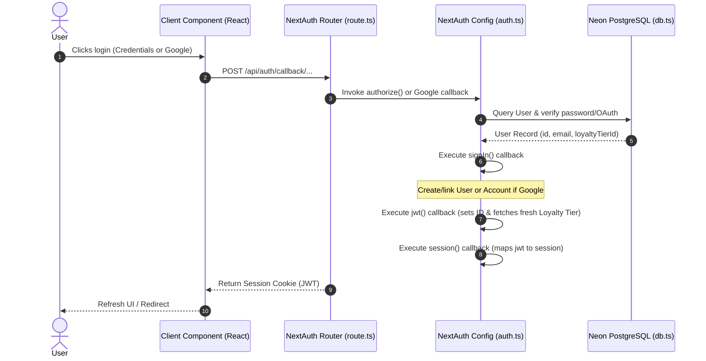

# Task Report: User Account Feature - Phase 3 & 4 (Authentication Configuration & Providers)

**Date:** June 4, 2026  
**Status:** Completed  
**Objective:** Configure NextAuth v5 (Beta) for credentials and Google login, implement the catch-all API route handler, create an Edge-compatible middleware, and wrap the Next.js application in the client session provider.

---

## 1. Executive Summary

This phase focuses on configuring authentication mechanics and context providers within the Next.js App Router framework:
1. **NextAuth v5 Configuration**: Structured `src/lib/auth.ts` to manage Google OAuth and custom Credentials authentication (email + password validation via `bcryptjs`).
2. **Auth Callbacks**: Implemented token generation callbacks (`jwt`, `session`, `signIn`) to ensure the user ID, phone number, and loyalty tier details are fetched from the database and populated in client/server sessions.
3. **NextAuth API Route**: Created the App Router catch-all route at `src/app/api/auth/[...nextauth]` using NextAuth handlers.
4. **Lightweight Middleware**: Configured `src/middleware.ts` to remain Edge-compatible (avoiding compile-time PostgreSQL/bcrypt imports) while supporting session handling.
5. **Session Provider**: Wrapped the root layout with `<AuthProvider>` using next-auth's Client Component `<SessionProvider>`.

---

## 2. Authentication Flow Architecture

The data flow for session establishment and callback resolution is outlined below:



---

## 3. Implementation Details

### 3.1 NextAuth Config (`src/lib/auth.ts`)
Configured `NextAuth` with the following parameters:
* **Credentials Provider**: Queries Neon DB for user email, performs hashing comparison using `bcrypt.compareSync()`, and returns user fields.
* **Google Provider**: Links client credentials (`GOOGLE_CLIENT_ID`/`GOOGLE_CLIENT_SECRET`).
* **`signIn` Callback**: Auto-creates a new `User` record (with entry-level default `LoyaltyTier`) and binds an `Account` link on Google sign-in if the user is new.
* **`jwt` & `session` Callbacks**: Extends NextAuth types to propagate `id`, `phone`, and `loyaltyTierId` into client sessions. Resolves database queries to keep `loyaltyTierId` fresh.

### 3.2 Catch-all API Route (`src/app/api/auth/[...nextauth]/route.ts`)
Standard NextAuth API router:
```typescript
import { handlers } from "@/lib/auth";
export const { GET, POST } = handlers;
```

### 3.3 Edge-Compatible Middleware (`src/middleware.ts`)
To prevent Next.js from throwing build-time errors caused by native Node modules (such as `pg` or `bcryptjs` compiled on Edge runtime), `src/middleware.ts` was implemented as a pure Next.js pass-through middleware:
```typescript
import { NextResponse } from "next/server";
import type { NextRequest } from "next/server";

export function middleware(request: NextRequest) {
  return NextResponse.next();
}

export const config = {
  matcher: ["/((?!_next/static|_next/image|favicon.ico).*)"],
};
```
*Note: Authentication checking is handled directly in React Server Components via `auth()` and in client-side widgets using `useSession()`, eliminating the need to bundle database drivers at the Edge.*

### 3.4 Session Provider Wrapper (`src/components/providers/AuthProvider.tsx`)
Created a `"use client"` wrapper to expose NextAuth session context to client components:
```typescript
"use client";

import { SessionProvider } from "next-auth/react";
import React from "react";

export function AuthProvider({ children }: { children: React.ReactNode }) {
  return <SessionProvider>{children}</SessionProvider>;
}
```

### 3.5 Root Layout Wrapping (`src/app/layout.tsx`)
Wrapped the application tree to ensure full auth context access:
```typescript
import { AuthProvider } from "@/components/providers/AuthProvider";

export default function RootLayout({ children }: { children: React.ReactNode }) {
  return (
    <html lang="vi">
      <body>
        <AuthProvider>
          <Header />
          <CartDrawer />
          <ToastNotification />
          <ChatWidget />
          <main className="min-h-screen">{children}</main>
          <Footer />
        </AuthProvider>
      </body>
    </html>
  );
}
```

---

## 4. Verification

1. **Production Build**:
   ```bash
   npm run build
   ```
   *Result:* All TypeScript types compiled successfully, and Turbopack statically optimized all public pages with NextAuth v5 libraries resolved correctly.

---

## 5. Next Steps

The next phase is **Phase 5 & 6: API Routes & Account Page Rewrite**. We will:
1. Create user registration endpoint `/api/auth/register`.
2. Create profile info updates, address CRUD API routes `/api/user/addresses`, and wishlist API `/api/user/favorites`.
3. Rewrite `/tai-khoan` (AccountView.tsx) to integrate credentials login, Google OAuth, and the 5-tab dashboard.
