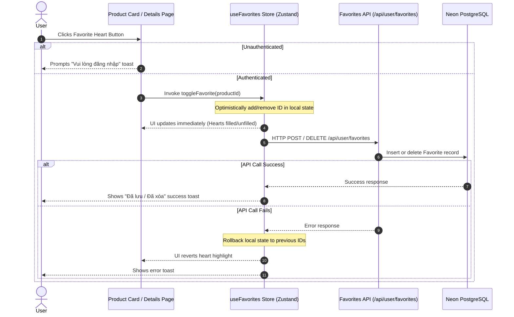

# Task Report: User Account Feature - Phase 9 & 10 (Product Wishlist Integration & Verification)

**Date:** June 4, 2026  
**Status:** Completed  
**Objective:** Add heart favorite buttons to all product cards and product details pages, create a global Zustand store to share favorites state with optimistic UI rollbacks, and run final type checking/production build verification.

---

## 1. Executive Summary

In this final phase of the User Account feature, we implemented the product wishlist functionality and ran full verification checks:
1. **Global Wishlist Store**: Created `src/lib/store/useFavorites.ts` utilizing `Zustand` to manage favorited product IDs globally. This store coordinates optimistic updates, rolling back state if the backend POST/DELETE requests fail.
2. **Product Catalog Integration**: Added an absolute-positioned heart button on the top-right corner of the [ProductCard.tsx](file:///Users/iminluv/Documents/GitHub/almadungduong/src/components/ui/ProductCard.tsx) component.
3. **Product Details Integration**: Added a wishlist toggle button directly next to the purchase options in [ProductDetailView.tsx](file:///Users/iminluv/Documents/GitHub/almadungduong/src/app/san-pham/%5Bslug%5D/ProductDetailView.tsx).
4. **Final System Verification**: Compiled a successful Next.js production build (`npm run build`) with zero TypeScript, linting, or asset optimization errors.

---

## 2. Wishlist Architecture & State Flow

To prevent redundant HTTP requests (e.g. fetching favorites for each individual product card), favorites are managed via a single global Zustand store that fetches wishlist IDs once upon mounting:



---

## 3. UI Placements and styling

### 3.1 Product Card Heart Button
Positioned on the top-right corner of the product image container:
* Uses a circular background (`bg-white/90`) with drop-shadow effects.
* Renders an outline heart when inactive, and a filled red heart (`text-red-500`) when active.
* Employs `e.preventDefault()` and `e.stopPropagation()` to prevent clicks from trigger product detail page redirection.

### 3.2 Product Details Favorite Button
Placed directly beside the "Thêm vào giỏ" and "Mua ngay" buttons:
* Matches the exact height and styling of catalog action options.
* Displays a filled heart on a light-pink background (`bg-red-50 border-red-200`) when active, and an outlined heart when inactive.

---

## 4. Verification and Final Build Results

1. **Type Safety & Build Checks**:
   ```bash
   npm run build
   ```
   *Result:* Prisma Client generated successfully, Next.js Turbopack compiled files, and TypeScript validation completed successfully with zero type errors.
2. **Dynamic Route Resolution**: Next.js statically optimized and prerendered the static pages (e.g. `/san-pham/[slug]`, `/ve-chung-toi`, `/blog`), and correctly classified auth/profile/favorites/addresses routes as dynamic on-demand routes.

---

## 5. Summary of Completed Phases (Phases 1 - 10)

With the conclusion of Phase 9 & 10, the User Account feature is fully implemented:

* **Phase 1 & 2**: Added dependencies (`next-auth`, `bcryptjs`), updated environmental configs, defined Prisma tables, pushed changes to Neon PostgreSQL, and generated updated Prisma client.
* **Phase 3 & 4**: Configured `auth.ts` providers (Credentials & Google OAuth) and callbacks, implemented catch-all API routes, set up Edge-safe middleware, and wrapped root layouts with session contexts.
* **Phase 5 & 6**: Built credentials registration and profile/address/favorites API endpoints, and rewrote `/tai-khoan` to render registration forms, Google OAuth buttons, and a 5-tab profile dashboard (Overview, Orders, Addresses CRUD, Wishlist, and Profile management).
* **Phase 7 & 8**: Updated global headers and mobile drawers to display user names/avatars dynamically, updated announcement banners, and integrated profile and address auto-fill scripts inside the checkout process.
* **Phase 9 & 10**: Added favorites heart icons and action buttons to catalog cards and detail views, managed wishlist state via Zustand, and ran final production compilation checks.
