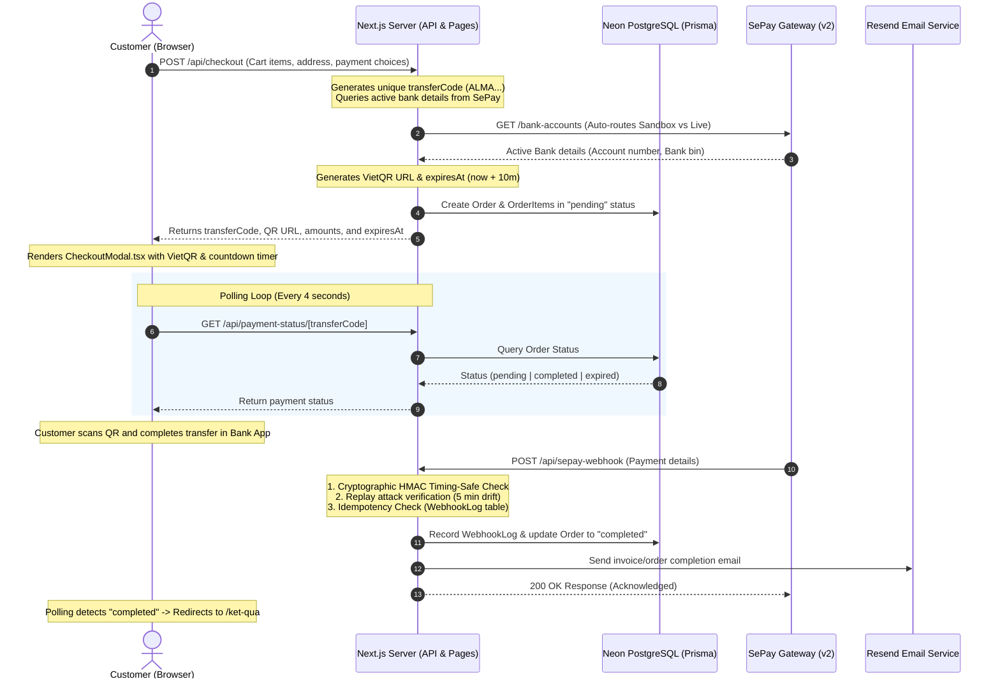

# SePay Bank Transfer Integration Report (6-6-26)

This document provides a detailed overview of the design, database models, API endpoints, security mechanisms, and client workflows implemented to integrate the **SePay Payment Gateway (v2 API)** for automated bank transfer payments.

---

## 1. System Architecture & Flow

The automated payment system is built on dynamic VietQR code generation, database order status polling, and secure webhook notifications from the SePay gateway.



---

## 2. Relational Database Schema Additions

Three new tables were defined and pushed to Neon PostgreSQL using Prisma 7:

### `Order`
Tracks purchase sessions, transaction totals, shipping details, and snapshot bank details used during checkout.
*   `id`: Primary key (`cuid()`).
*   `userId`: Relations link to member accounts (`User`). Supports unauthenticated checkout mapping to a generic placeholder.
*   `transferCode`: Unique tracking code (e.g., `ALMA7KX9B2HT`) embedded in the bank transfer memo.
*   `amount` / `shippingFee` / `totalAmount`: Financial totals recorded in VND.
*   `status`: Order phase tracking (`pending` | `completed` | `expired`).
*   `shippingName` / `shippingPhone` / `shippingEmail` / `shippingAddress`: Immutable recipient snapshot.
*   `bankAccount` / `bankName` / `accountName` / `qrUrl`: Captured bank transfer endpoints and VietQR links.
*   `userClaimed` / `claimedAt`: Flags manual claim notifications if transfers are delayed.
*   `expiresAt` / `completedAt` / `createdAt` / `updatedAt`: Life cycle timestamps.

### `OrderItem`
Maintains relational line items for orders.
*   `id`: Primary key (`cuid()`).
*   `orderId`: Linked parent `Order` ID.
*   `productId` / `title` / `price` / `quantity` / `variant` / `image`: Captures historical purchase state so adjustments to the live product catalog do not retroactively corrupt older invoices.

### `WebhookLog`
Enforces idempotency to prevent duplicate payments.
*   `id`: Primary key (`cuid()`).
*   `sepayId`: Unique SePay transaction identifier (`Int`) to prevent processing the same transaction payload twice.
*   `payload`: Raw JSON payload.
*   `status`: Processing phase (`received` | `processed` | `unmatched` | `amount_mismatch`).
*   `matchedOrderId`: Nullable lookup link to corresponding order details.

---

## 3. Backend Endpoints Summary

### 1. Checkout Endpoint (`/api/checkout`)
*   **Method**: `POST`
*   **Behavior**:
    *   Saves the billing snapshot in the database.
    *   Contacts SePay v2 client API using `sepay.ts` helper to grab active accounts.
    *   Builds a personalized VietQR link using VietQR templates (`https://img.vietqr.io/image/...`).
    *   Returns the payment payload back to the modal view.
    *   Includes a fallback option pointing to static credentials in `.env` if the API limits out.

### 2. Status Polling Endpoint (`/api/payment-status/[transferCode]`)
*   **Method**: `GET`
*   **Behavior**:
    *   Reads order status and details to let the client modal update its UI instantly.
    *   Handles expirations safely by changing statuses from `pending` to `expired` if checkout exceeds the 10-minute timeout.

### 3. Claim Transfer Endpoint (`/api/claim-transfer`)
*   **Method**: `POST`
*   **Behavior**:
    *   Updates the target order's `userClaimed` and `claimedAt` flags.
    *   Fires console/logs developer alerts for administrators to manual-check the physical banking applications if necessary.

### 4. Webhook Callback Endpoint (`/api/sepay-webhook`)
*   **Method**: `POST`
*   **Behavior**:
    *   The single most critical payment receiver endpoint.
    *   **Double Verification Security**:
        1.  *Bearer Validation*: Matches custom header `Authorization: Apikey <token>` checks if signatures are not enabled.
        2.  *Cryptographic Signature Validation*: Checks the presence of the `x-sepay-signature` header. Computes `HMAC-SHA256` hash of the raw string payload using the secret key (`SEPAY_WEBHOOK_SECRET_KEY`). Executes timing-safe comparisons to prevent timing analysis exploits.
        3.  *Replay Protection*: Compares payload transaction times with server timestamps, asserting that request latency does not exceed 5 minutes.
    *   **Idempotency Protection**: Looks up existing `WebhookLog` rows. If already processed, returns immediately with a `200 OK` status to avoid double credits or order duplicate completions.
    *   **Post-processing**: Updates corresponding order rows, awards loyalty points, and dispatches dynamic HTML invoice templates via Resend.

---

## 4. Automatic Sandbox vs. Live Gateway Routing

To prevent sandbox tokens from triggering production routing and throwing `401 Unauthorized` responses from the SePay gateway, the integration client auto-detects Test Mode configurations:

```typescript
const isSandbox = apiKey.startsWith("KJQ");
const baseUrl = isSandbox 
  ? "https://userapi-sandbox.sepay.vn" 
  : "https://userapi.sepay.vn";
```

This dynamically adjusts all backend calls targeting `/bank-accounts` depending on the credential variables active in `.env`.

---

## 5. Timing-Safe Webhook HMAC Verification Detail

The HMAC validation is implemented within `/api/sepay-webhook/route.ts` as follows:

```typescript
// Read raw request body to construct correct signatures
const rawBody = await req.text();
const signatureHeader = req.headers.get("x-sepay-signature");

if (signatureHeader) {
  const secretKey = process.env.SEPAY_WEBHOOK_SECRET_KEY;
  if (!secretKey) {
    throw new Error("Missing webhook secret configuration.");
  }
  
  // Compute HMAC SHA-256 signature
  const computedSignature = crypto
    .createHmac("sha256", secretKey)
    .update(rawBody)
    .digest("hex");

  // Timing-safe comparison to mitigate side-channel timing analysis attacks
  const isMatch = crypto.timingSafeEqual(
    Buffer.from(signatureHeader, "hex"),
    Buffer.from(computedSignature, "hex")
  );

  if (!isMatch) {
    return NextResponse.json({ error: "Invalid signature" }, { status: 401 });
  }
}
```

---

## 6. How to Run Webhook Simulations

To verify the end-to-end webhook processing locally, developers can trigger mock payments using curls against the tunnel (e.g. ngrok).

### Signature Simulation Command
Below is a utility template script to calculate HMAC signatures and post transaction reports:

```bash
#!/usr/bin/env bash

TARGET_URL="http://localhost:4000/api/sepay-webhook"
SECRET="your_webhook_secret_here"
TRANSFER_CODE="ALMA7KX9B2HT"

PAYLOAD='{
  "id": 1234567,
  "gateway": "VCB",
  "transactionDate": "2026-06-06 19:30:00",
  "accountNumber": "1234567890",
  "subAccount": "1234567890",
  "amountIn": 150000,
  "amountOut": 0,
  "accumulated": 5000000,
  "code": "'$TRANSFER_CODE'",
  "transactionContent": "ALMA7KX9B2HT chuyen tien mua hang",
  "referenceNumber": "FT2615789421",
  "body": "ALMA7KX9B2HT chuyen tien mua hang",
  "transferType": "in"
}'

# Compute HMAC signature
SIGNATURE=$(echo -n "$PAYLOAD" | openssl dgst -sha256 -hmac "$SECRET" | cut -d" " -f2)

curl -X POST "$TARGET_URL" \
  -H "Content-Type: application/json" \
  -H "x-sepay-signature: $SIGNATURE" \
  -d "$PAYLOAD"
```
