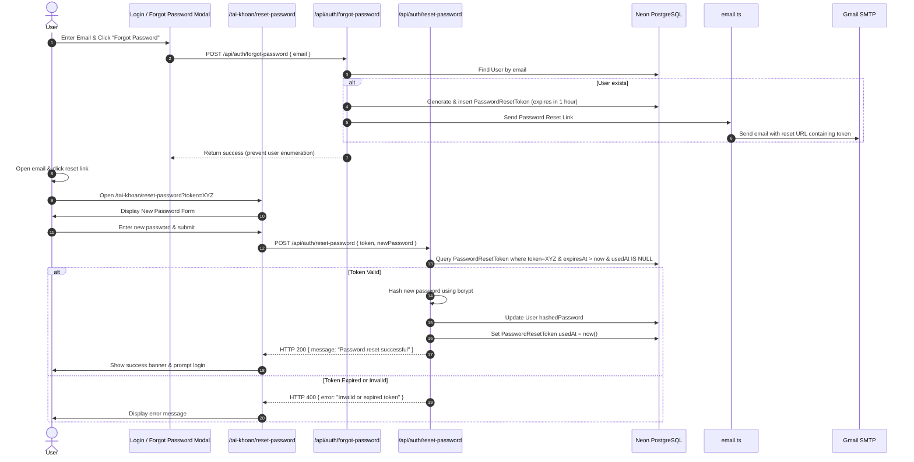

```mermaid
sequenceDiagram
    autonumber
    actor User
    participant AuthModal as Login / Forgot Password Modal
    participant ResetPage as /tai-khoan/reset-password
    participant ForgotAPI as /api/auth/forgot-password
    participant ResetAPI as /api/auth/reset-password
    participant DB as Neon PostgreSQL
    participant EmailLib as email.ts
    participant GmailSMTP as Gmail SMTP

    User->>AuthModal: Enter Email & Click "Forgot Password"
    AuthModal->>ForgotAPI: POST /api/auth/forgot-password { email }
    ForgotAPI->>DB: Find User by email
    alt User exists
        ForgotAPI->>DB: Generate & insert PasswordResetToken (expires in 1 hour)
        ForgotAPI->>EmailLib: Send Password Reset Link
        EmailLib->>GmailSMTP: Send email with reset URL containing token
    end
    ForgotAPI-->>AuthModal: Return success (prevent user enumeration)
    
    User->>User: Open email & click reset link
    User->>ResetPage: Open /tai-khoan/reset-password?token=XYZ
    ResetPage->>User: Display New Password Form
    User->>ResetPage: Enter new password & submit
    ResetPage->>ResetAPI: POST /api/auth/reset-password { token, newPassword }
    ResetAPI->>DB: Query PasswordResetToken where token=XYZ & expiresAt > now & usedAt IS NULL
    
    alt Token Valid
        ResetAPI->>ResetAPI: Hash new password using bcrypt
        ResetAPI->>DB: Update User hashedPassword
        ResetAPI->>DB: Set PasswordResetToken usedAt = now()
        ResetAPI-->>ResetPage: HTTP 200 { message: "Password reset successful" }
        ResetPage->>User: Show success banner & prompt login
    else Token Expired or Invalid
        ResetAPI-->>ResetPage: HTTP 400 { error: "Invalid or expired token" }
        ResetPage->>User: Display error message
    end
```
