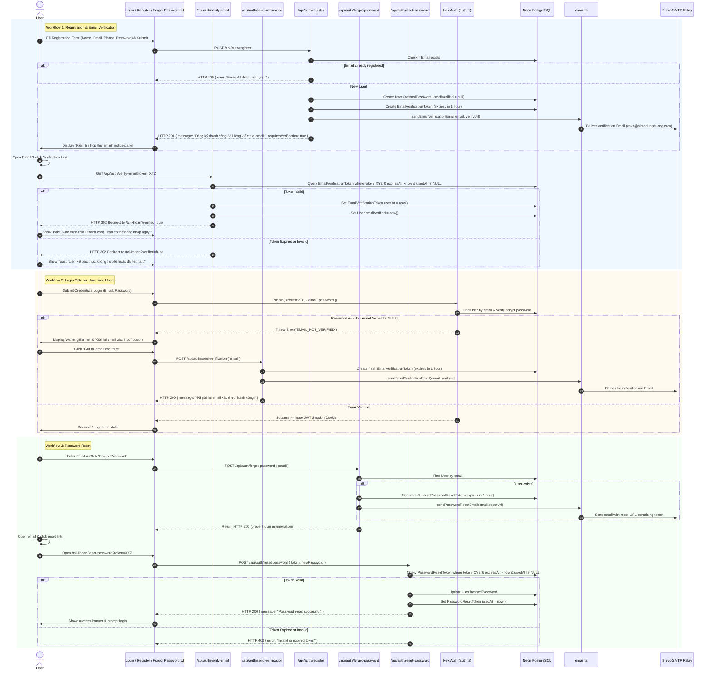

```mermaid
sequenceDiagram
    autonumber
    actor User
    participant AuthModal as Login / Register / Forgot Password UI
    participant VerifyAPI as /api/auth/verify-email
    participant SendVerifyAPI as /api/auth/send-verification
    participant RegisterAPI as /api/auth/register
    participant ForgotAPI as /api/auth/forgot-password
    participant ResetAPI as /api/auth/reset-password
    participant NextAuth as NextAuth (auth.ts)
    participant DB as Neon PostgreSQL
    participant EmailLib as email.ts
    participant Brevo as Brevo SMTP Relay

    %% --- WORKFLOW 1: User Registration & Email Verification ---
    rect rgb(240, 248, 255)
    note right of User: Workflow 1: Registration & Email Verification
    User->>AuthModal: Fill Registration Form (Name, Email, Phone, Password) & Submit
    AuthModal->>RegisterAPI: POST /api/auth/register
    RegisterAPI->>DB: Check if Email exists
    alt Email already registered
        RegisterAPI-->>AuthModal: HTTP 400 { error: "Email đã được sử dụng." }
    else New User
        RegisterAPI->>DB: Create User (hashedPassword, emailVerified = null)
        RegisterAPI->>DB: Create EmailVerificationToken (expires in 1 hour)
        RegisterAPI->>EmailLib: sendEmailVerificationEmail(email, verifyUrl)
        EmailLib->>Brevo: Deliver Verification Email (cskh@almadungduong.com)
        RegisterAPI-->>AuthModal: HTTP 201 { message: "Đăng ký thành công. Vui lòng kiểm tra email.", requiresVerification: true }
        AuthModal->>User: Display "Kiểm tra hộp thư email" notice panel
    end

    User->>User: Open Email & click Verification Link
    User->>VerifyAPI: GET /api/auth/verify-email?token=XYZ
    VerifyAPI->>DB: Query EmailVerificationToken where token=XYZ & expiresAt > now & usedAt IS NULL
    alt Token Valid
        VerifyAPI->>DB: Set EmailVerificationToken usedAt = now()
        VerifyAPI->>DB: Set User.emailVerified = now()
        VerifyAPI-->>User: HTTP 302 Redirect to /tai-khoan?verified=true
        User->>AuthModal: Show Toast "Xác thực email thành công! Bạn có thể đăng nhập ngay."
    else Token Expired or Invalid
        VerifyAPI-->>User: HTTP 302 Redirect to /tai-khoan?verified=false
        User->>AuthModal: Show Toast "Liên kết xác thực không hợp lệ hoặc đã hết hạn."
    end
    end

    %% --- WORKFLOW 2: Credentials Login Gate ---
    rect rgb(255, 250, 240)
    note right of User: Workflow 2: Login Gate for Unverified Users
    User->>AuthModal: Submit Credentials Login (Email, Password)
    AuthModal->>NextAuth: signIn("credentials", { email, password })
    NextAuth->>DB: Find User by email & verify bcrypt password
    alt Password Valid but emailVerified IS NULL
        NextAuth-->>AuthModal: Throw Error("EMAIL_NOT_VERIFIED")
        AuthModal->>User: Display Warning Banner & "Gửi lại email xác thực" button
        User->>AuthModal: Click "Gửi lại email xác thực"
        AuthModal->>SendVerifyAPI: POST /api/auth/send-verification { email }
        SendVerifyAPI->>DB: Create fresh EmailVerificationToken (expires in 1 hour)
        SendVerifyAPI->>EmailLib: sendEmailVerificationEmail(email, verifyUrl)
        EmailLib->>Brevo: Deliver fresh Verification Email
        SendVerifyAPI-->>AuthModal: HTTP 200 { message: "Đã gửi lại email xác thực thành công!" }
    else Email Verified
        NextAuth-->>AuthModal: Success -> Issue JWT Session Cookie
        AuthModal->>User: Redirect / Logged in state
    end
    end

    %% --- WORKFLOW 3: Password Reset ---
    rect rgb(245, 255, 245)
    note right of User: Workflow 3: Password Reset
    User->>AuthModal: Enter Email & Click "Forgot Password"
    AuthModal->>ForgotAPI: POST /api/auth/forgot-password { email }
    ForgotAPI->>DB: Find User by email
    alt User exists
        ForgotAPI->>DB: Generate & insert PasswordResetToken (expires in 1 hour)
        ForgotAPI->>EmailLib: sendPasswordResetEmail(email, resetUrl)
        EmailLib->>Brevo: Send email with reset URL containing token
    end
    ForgotAPI-->>AuthModal: Return HTTP 200 (prevent user enumeration)
    
    User->>User: Open email & click reset link
    User->>AuthModal: Open /tai-khoan/reset-password?token=XYZ
    AuthModal->>ResetAPI: POST /api/auth/reset-password { token, newPassword }
    ResetAPI->>DB: Query PasswordResetToken where token=XYZ & expiresAt > now & usedAt IS NULL
    
    alt Token Valid
        ResetAPI->>DB: Update User hashedPassword
        ResetAPI->>DB: Set PasswordResetToken usedAt = now()
        ResetAPI-->>AuthModal: HTTP 200 { message: "Password reset successful" }
        AuthModal->>User: Show success banner & prompt login
    else Token Expired or Invalid
        ResetAPI-->>AuthModal: HTTP 400 { error: "Invalid or expired token" }
    end
    end
```
