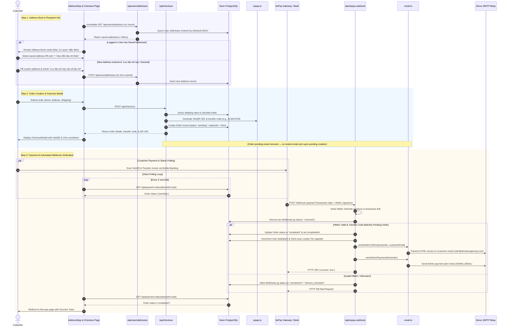

```mermaid
sequenceDiagram
    autonumber
    actor Customer
    participant CheckoutUI as AddressStep & Checkout Page
    participant AddressAPI as /api/user/addresses
    participant CheckoutAPI as /api/checkout
    participant DB as Neon PostgreSQL
    participant SePayLib as sepay.ts
    participant SePayGW as SePay Gateway / Bank
    participant WebhookAPI as /api/sepay-webhook
    participant EmailLib as email.ts
    participant Brevo as Brevo SMTP Relay

    %% --- STEP 1: Address Book & Delivery Selection ---
    rect rgb(245, 245, 255)
    note right of Customer: Step 1: Address Book & Recipient Info
    CheckoutUI->>AddressAPI: Immediate GET /api/user/addresses (on mount)
    AddressAPI->>DB: Query User addresses ordered by isDefault DESC
    AddressAPI-->>CheckoutUI: Return saved addresses (~50ms)
    alt Logged-in User has Saved Addresses
        CheckoutUI->>Customer: Render Address Book cards (Nhà, Cơ quan, Mặc định)
        Customer->>CheckoutUI: Select saved address OR pick "+ Giao đến địa chỉ khác"
    else New Address entered & "Lưu địa chỉ này" checked
        Customer->>CheckoutUI: Fill custom address & check "Lưu địa chỉ này vào sổ địa chỉ"
        CheckoutUI->>AddressAPI: POST /api/user/addresses (on form submit)
        AddressAPI->>DB: Insert new Address record
    end
    end

    %% --- STEP 2: Order Creation ---
    rect rgb(240, 248, 255)
    note right of Customer: Step 2: Order Creation & Payment Modal
    Customer->>CheckoutUI: Submit order (Items, Address, Shipping)
    CheckoutUI->>CheckoutAPI: POST /api/checkout
    CheckoutAPI->>DB: Query shipping rates & calculate totals
    CheckoutAPI->>SePayLib: Generate VietQR URL & transfer code (e.g., ALMA7KX9)
    CheckoutAPI->>DB: Create Order record (status: "pending", expiresAt: +10m)
    CheckoutAPI-->>CheckoutUI: Return order details, transfer code, & QR URL
    CheckoutUI->>Customer: Display CheckoutModal with VietQR & 10m countdown
    note over CheckoutAPI,EmailLib: (Order pending email removed — no instant email sent upon pending creation)
    end

    %% --- STEP 3: Payment & Webhook Processing ---
    rect rgb(255, 250, 240)
    note right of Customer: Step 3: Payment & Automated Webhook Verification
    par Customer Payment & Status Polling
        Customer->>SePayGW: Scan VietQR & Transfer money via Mobile Banking
    and Client Polling Loop
        loop Every 3 seconds
            CheckoutUI->>DB: GET /api/payment-status/[transferCode]
            DB-->>CheckoutUI: Order status ("pending")
        end
    end

    SePayGW->>WebhookAPI: POST Webhook payload (Transaction data + HMAC signature)
    WebhookAPI->>WebhookAPI: Verify HMAC SHA256 signature & timestamp drift
    WebhookAPI->>DB: Record raw WebhookLog (status: "received")
    
    alt HMAC Valid & Transfer Code Matches Pending Order
        WebhookAPI->>DB: Update Order status to "completed" & set completedAt
        WebhookAPI->>DB: Increment User totalSpent & check auto Loyalty Tier upgrade
        WebhookAPI->>EmailLib: sendOrderConfirmation(order, customerEmail)
        EmailLib->>Brevo: Transmit HTML invoice to Customer email (cskh@almadungduong.com)
        WebhookAPI->>EmailLib: sendAdminPaymentAlert(order)
        EmailLib->>Brevo: Send Admin payment alert email (ADMIN_EMAIL)
        WebhookAPI-->>SePayGW: HTTP 200 { success: true }
    else Invalid HMAC / Mismatch
        WebhookAPI->>DB: Mark WebhookLog status as "unmatched" / "amount_mismatch"
        WebhookAPI-->>SePayGW: HTTP 400 Bad Request
    end

    CheckoutUI->>DB: GET /api/payment-status/[transferCode]
    DB-->>CheckoutUI: Order status ("completed")
    CheckoutUI->>Customer: Redirect to /ket-qua page with Success Toast
    end
```
