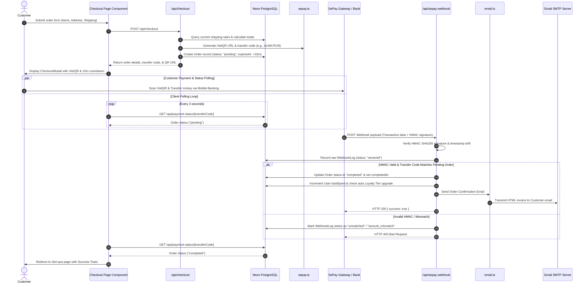

```mermaid
sequenceDiagram
    autonumber
    actor Customer
    participant CheckoutUI as Checkout Page Component
    participant CheckoutAPI as /api/checkout
    participant DB as Neon PostgreSQL
    participant SePayLib as sepay.ts
    participant SePayGW as SePay Gateway / Bank
    participant WebhookAPI as /api/sepay-webhook
    participant EmailLib as email.ts
    participant GmailSMTP as Gmail SMTP Server

    Customer->>CheckoutUI: Submit order form (Items, Address, Shipping)
    CheckoutUI->>CheckoutAPI: POST /api/checkout
    CheckoutAPI->>DB: Query current shipping rates & calculate totals
    CheckoutAPI->>SePayLib: Generate VietQR URL & transfer code (e.g., ALMA7KX9)
    CheckoutAPI->>DB: Create Order record (status: "pending", expiresAt: +10m)
    CheckoutAPI-->>CheckoutUI: Return order details, transfer code, & QR URL
    CheckoutUI->>Customer: Display CheckoutModal with VietQR & 10m countdown

    par Customer Payment & Status Polling
        Customer->>SePayGW: Scan VietQR & Transfer money via Mobile Banking
    and Client Polling Loop
        loop Every 3 seconds
            CheckoutUI->>DB: GET /api/payment-status/[transferCode]
            DB-->>CheckoutUI: Order status ("pending")
        end
    end

    SePayGW->>WebhookAPI: POST Webhook payload (Transaction data + HMAC signature)
    WebhookAPI->>WebhookAPI: Verify HMAC SHA256 signature & timestamp drift
    WebhookAPI->>DB: Record raw WebhookLog (status: "received")
    
    alt HMAC Valid & Transfer Code Matches Pending Order
        WebhookAPI->>DB: Update Order status to "completed" & set completedAt
        WebhookAPI->>DB: Increment User totalSpent & check auto Loyalty Tier upgrade
        WebhookAPI->>EmailLib: Send Order Confirmation Email
        EmailLib->>GmailSMTP: Transmit HTML invoice to Customer email
        WebhookAPI-->>SePayGW: HTTP 200 { success: true }
    else Invalid HMAC / Mismatch
        WebhookAPI->>DB: Mark WebhookLog status as "unmatched" / "amount_mismatch"
        WebhookAPI-->>SePayGW: HTTP 400 Bad Request
    end

    CheckoutUI->>DB: GET /api/payment-status/[transferCode]
    DB-->>CheckoutUI: Order status ("completed")
    CheckoutUI->>Customer: Redirect to /ket-qua page with Success Toast
```
