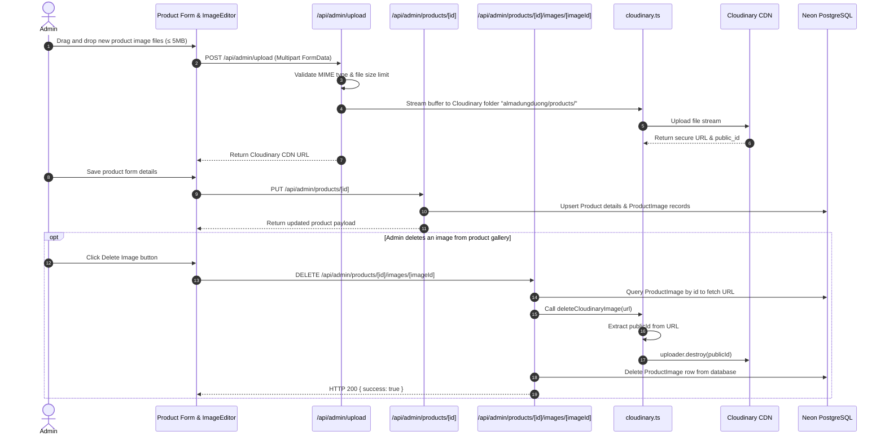

```mermaid
sequenceDiagram
    autonumber
    actor Admin
    participant AdminUI as Product Form & ImageEditor
    participant UploadAPI as /api/admin/upload
    participant ProductAPI as /api/admin/products/[id]
    participant ImageAPI as /api/admin/products/[id]/images/[imageId]
    participant CloudinaryLib as cloudinary.ts
    participant CloudinaryCloud as Cloudinary CDN
    participant DB as Neon PostgreSQL

    Admin->>AdminUI: Drag and drop new product image files (≤ 5MB)
    AdminUI->>UploadAPI: POST /api/admin/upload (Multipart FormData)
    UploadAPI->>UploadAPI: Validate MIME type & file size limit
    UploadAPI->>CloudinaryLib: Stream buffer to Cloudinary folder "almadungduong/products/"
    CloudinaryLib->>CloudinaryCloud: Upload file stream
    CloudinaryCloud-->>CloudinaryLib: Return secure URL & public_id
    UploadAPI-->>AdminUI: Return Cloudinary CDN URL
    
    Admin->>AdminUI: Save product form details
    AdminUI->>ProductAPI: PUT /api/admin/products/[id]
    ProductAPI->>DB: Upsert Product details & ProductImage records
    ProductAPI-->>AdminUI: Return updated product payload

    opt Admin deletes an image from product gallery
        Admin->>AdminUI: Click Delete Image button
        AdminUI->>ImageAPI: DELETE /api/admin/products/[id]/images/[imageId]
        ImageAPI->>DB: Query ProductImage by id to fetch URL
        ImageAPI->>CloudinaryLib: Call deleteCloudinaryImage(url)
        CloudinaryLib->>CloudinaryLib: Extract publicId from URL
        CloudinaryLib->>CloudinaryCloud: uploader.destroy(publicId)
        ImageAPI->>DB: Delete ProductImage row from database
        ImageAPI-->>AdminUI: HTTP 200 { success: true }
    end
```
