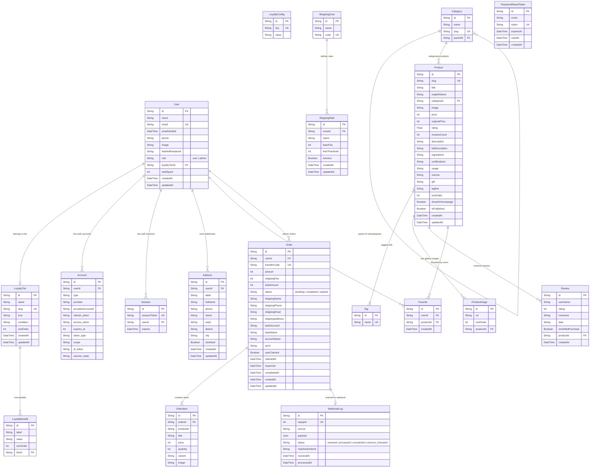

```mermaid
erDiagram
    User {
        String id PK
        String name
        String email UK
        DateTime emailVerified
        String phone
        String image
        String hashedPassword
        String role "user | admin"
        String loyaltyTierId FK
        Int totalSpent
        DateTime createdAt
        DateTime updatedAt
    }

    LoyaltyTier {
        String id PK
        String name
        String slug UK
        String icon
        String condition
        Int sortOrder
        DateTime createdAt
        DateTime updatedAt
    }

    LoyaltyBenefit {
        String id PK
        String label
        String value
        Int sortOrder
        String tierId FK
    }

    LoyaltyConfig {
        String id PK
        String key UK
        String value
    }

    Product {
        String id PK
        String slug UK
        String title
        String englishName
        String categoryId FK
        String image
        Int price
        Int originalPrice
        Float rating
        Int reviewsCount
        String description
        String fullDescription
        String ingredients
        String certifications
        String usage
        String volume
        String gift
        String tagline
        Int sortOrder
        Boolean showOnHomepage
        Boolean isPublished
        DateTime createdAt
        DateTime updatedAt
    }

    Category {
        String id PK
        String name
        String slug UK
        String parentId FK
    }

    Tag {
        String id PK
        String name UK
    }

    ProductImage {
        String id PK
        String url
        Int sortOrder
        String productId FK
    }

    Review {
        String id PK
        String userName
        Int rating
        String comment
        String date
        Boolean isVerifiedPurchase
        String productId FK
        DateTime createdAt
    }

    ShippingZone {
        String id PK
        String name
        String code UK
    }

    ShippingRate {
        String id PK
        String zoneId FK
        String name
        Int baseFee
        Int freeThreshold
        Boolean isActive
        DateTime createdAt
        DateTime updatedAt
    }

    Account {
        String id PK
        String userId FK
        String type
        String provider
        String providerAccountId
        String refresh_token
        String access_token
        Int expires_at
        String token_type
        String scope
        String id_token
        String session_state
    }

    Session {
        String id PK
        String sessionToken UK
        String userId FK
        DateTime expires
    }

    Address {
        String id PK
        String userId FK
        String label
        String fullName
        String phone
        String street
        String ward
        String district
        String city
        Boolean isDefault
        DateTime createdAt
        DateTime updatedAt
    }

    Favorite {
        String id PK
        String userId FK
        String productId FK
        DateTime createdAt
    }

    Order {
        String id PK
        String userId FK
        String transferCode UK
        Int amount
        Int shippingFee
        Int totalAmount
        String status "pending | completed | expired"
        String shippingName
        String shippingPhone
        String shippingEmail
        String shippingAddress
        String bankAccount
        String bankName
        String accountName
        String qrUrl
        Boolean userClaimed
        DateTime claimedAt
        DateTime expiresAt
        DateTime completedAt
        DateTime createdAt
        DateTime updatedAt
    }

    OrderItem {
        String id PK
        String orderId FK
        String productId
        String title
        Int price
        Int quantity
        String variant
        String image
    }

    WebhookLog {
        String id PK
        Int sepayId UK
        String source
        Json payload
        String status "received | processed | unmatched | amount_mismatch"
        String matchedOrderId
        DateTime receivedAt
        DateTime processedAt
    }

    PasswordResetToken {
        String id PK
        String email
        String token UK
        DateTime expiresAt
        DateTime usedAt
        DateTime createdAt
    }

    User ||--o| LoyaltyTier : "belongs to tier"
    LoyaltyTier ||--o{ LoyaltyBenefit : "has benefits"
    User ||--o{ Account : "has auth accounts"
    User ||--o{ Session : "has auth sessions"
    User ||--o{ Address : "owns addresses"
    User ||--o{ Favorite : "saves favorites"
    User ||--o{ Order : "places orders"
    
    Category ||--o{ Category : "parent of subcategories"
    Category ||--o{ Product : "categorizes products"
    Product }|--|{ Tag : "tagged with"
    Product ||--o{ ProductImage : "has gallery images"
    Product ||--o{ Review : "receives reviews"
    Product ||--o{ Favorite : "favorited by users"
    
    ShippingZone ||--o{ ShippingRate : "defines rates"
    
    Order ||--|{ OrderItem : "contains items"
    Order ||--o| WebhookLog : "matched in webhook"
```
