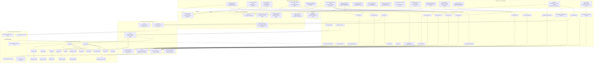

```mermaid
graph TB
    subgraph Client_Storefront ["Storefront UI & Client Pages (src/app)"]
        Page_Home["Homepage (page.tsx)<br/>HeroCarousel, MonthlyDeal, Feedback"]
        Page_Catalog["Product Catalog (/san-pham)<br/>ProductsContent & FilterSidebar"]
        Page_Detail["Product Detail (/san-pham/[slug])<br/>ProductDetailView & ReviewCard"]
        Page_Checkout["Checkout Form (/thanh-toan)<br/>Address autofill & Guest Checkout"]
        Page_Result["Checkout Result (/ket-qua)<br/>ResultsView & Success Banners"]
        Page_Account["Customer Dashboard (/tai-khoan)<br/>AccountView, Addresses CRUD, Orders"]
        Page_Reset["Password Reset (/tai-khoan/reset-password)<br/>Reset token validation form"]
        Page_Loyalty["Loyalty Program (/khach-hang-than-thiet)<br/>LoyaltyView & Tier benefits"]
        Page_Blog["Blog & Articles (/blog & /blog/[slug])<br/>BlogView & BlogDetailView"]
        Page_Cert["Certifications (/chung-chi)<br/>ChungChiView & SPF/Irritation test reports"]
        Page_About["Brand History (/ve-chung-toi)<br/>AboutView & Scientific overview"]
    end

    subgraph Client_Admin ["Admin Panel UI (src/app/admin)"]
        Admin_Shell["Admin Dashboard Shell (AdminShell)<br/>Sidebar & Responsive Layout"]
        Admin_Stats["Dashboard Home (/admin)<br/>Sales metrics & StatCard summary"]
        Admin_Orders["Orders Manager (/admin/orders & /[id])<br/>Order status & Claim verification"]
        Admin_Customers["Customers Directory (/admin/customers & /[id])<br/>Timeline & Spend history"]
        Admin_Products["Catalog Editor (/admin/products & /new & /[id]/edit)<br/>ProductForm & ImageEditor"]
        Admin_Settings["System Settings (/admin/settings)<br/>SettingsForm for Shipping & Loyalty"]
    end

    subgraph Client_State_Providers ["Client State, Hooks & Context Providers"]
        Store_Cart["Zustand Cart Store (useCart.ts)<br/>Cart items, quantities & CartDrawer"]
        Store_Fav["Zustand Favorites Store (useFavorites.ts)<br/>Wishlist items & heart toggles"]
        Hook_Upload["Image Upload Hook (useImageUpload.ts)<br/>MIME & size validation"]
        Hook_Protect["Content Protection Hook (use-content-protection.ts)<br/>DevTools detector & copy blocker"]
        Prov_Auth["AuthProvider<br/>NextAuth SessionProvider"]
        Prov_Protect["ContentProtectionProvider<br/>Anti-Copy & F12 overlay wrapper"]
    end

    subgraph Edge_Middleware ["Edge Layer"]
        Middleware["Middleware (src/middleware.ts)<br/>Edge pass-through route guard"]
    end

    subgraph API_Controllers ["API Route Handlers Layer (src/app/api)"]
        API_Auth_Reg["/api/auth/register"]
        API_Auth_Forgot["/api/auth/forgot-password"]
        API_Auth_Reset["/api/auth/reset-password"]
        API_Auth_Clean["/api/auth/cleanup-tokens"]
        API_Auth_Next["/api/auth/[...nextauth]"]
        
        API_Checkout["/api/checkout"]
        API_PaymentStatus["/api/payment-status/[transferCode]"]
        API_Webhook["/api/sepay-webhook"]
        API_Claim["/api/claim-transfer"]

        API_Products_List["/api/products"]
        API_Products_Detail["/api/products/[slug]"]
        API_Shipping["/api/shipping"]
        API_Loyalty["/api/loyalty"]

        API_User_Profile["/api/user/profile"]
        API_User_Addresses["/api/user/addresses"]
        API_User_Favorites["/api/user/favorites"]
        API_User_Orders["/api/user/orders"]

        API_Admin_Stats["/api/admin/stats"]
        API_Admin_Orders["/api/admin/orders/[id]"]
        API_Admin_Products["/api/admin/products & /[id]"]
        API_Admin_Images["/api/admin/products/[id]/images & /[imageId]"]
        API_Admin_Upload["/api/admin/upload"]
        API_Admin_Settings["/api/admin/settings/loyalty & /shipping"]
    end

    subgraph Core_Services ["Core Services & Domain Libraries (src/lib)"]
        Lib_Auth["auth.ts<br/>NextAuth v5 Config & Credentials/Google Provider"]
        Lib_DB["db.ts<br/>Prisma Client Singleton + Neon PG Adapter"]
        Lib_SePay["sepay.ts<br/>SePay API v2 Client & VietQR Generator"]
        Lib_Email["email.ts<br/>Nodemailer Gmail SMTP Engine & HTML Templates"]
        Lib_Cloudinary["cloudinary.ts<br/>Cloudinary SDK & Image Purge Engine"]
        Lib_Cleanup["token-cleanup.ts<br/>Expired Password Reset Token Cleanup"]
        Lib_Protection["use-content-protection.ts<br/>DevTools Overlay & Context Menu Blocker"]
    end

    subgraph Data_Models ["Prisma Database Layer (prisma/schema.prisma)"]
        DB_User[("User Table")]
        DB_LoyaltyTier[("LoyaltyTier Table")]
        DB_LoyaltyBenefit[("LoyaltyBenefit Table")]
        DB_LoyaltyConfig[("LoyaltyConfig Table")]
        DB_Product[("Product Table")]
        DB_Category[("Category Table")]
        DB_Tag[("Tag Table")]
        DB_ProductImage[("ProductImage Table")]
        DB_Review[("Review Table")]
        DB_ShippingZone[("ShippingZone Table")]
        DB_ShippingRate[("ShippingRate Table")]
        DB_Account[("Account Table")]
        DB_Session[("Session Table")]
        DB_Address[("Address Table")]
        DB_Favorite[("Favorite Table")]
        DB_Order[("Order Table")]
        DB_OrderItem[("OrderItem Table")]
        DB_WebhookLog[("WebhookLog Table")]
        DB_PasswordResetToken[("PasswordResetToken Table")]
    end

    subgraph External_Services ["External Infrastructure & Third-Party APIs"]
        Ext_Neon[("Neon Serverless PostgreSQL")]
        Ext_SePay["SePay Payment Gateway / VietQR"]
        Ext_Cloudinary["Cloudinary Storage CDN"]
        Ext_Gmail["Gmail SMTP Email Server"]
        Ext_Google["Google OAuth 2.0 Identity Server"]
    end

    %% Client UI to State & Context
    Page_Home & Page_Catalog & Page_Detail --> Store_Cart
    Page_Catalog & Page_Detail & Page_Account --> Store_Fav
    Admin_Products --> Hook_Upload
    Client_Storefront & Client_Admin -. Wrapper .-> Prov_Auth
    Client_Storefront & Client_Admin -. Wrapper .-> Prov_Protect
    Prov_Protect --> Hook_Protect

    %% Middleware Interception
    Client_Storefront & Client_Admin --> Middleware
    Middleware --> API_Controllers

    %% UI to API Route Calls
    Page_Checkout --> API_Checkout
    Page_Checkout --> API_PaymentStatus
    Page_Checkout --> API_Claim
    Page_Account --> API_User_Profile & API_User_Addresses & API_User_Favorites & API_User_Orders
    Page_Reset --> API_Auth_Reset
    Page_Catalog & Page_Home --> API_Products_List
    Page_Detail --> API_Products_Detail

    Admin_Stats --> API_Admin_Stats
    Admin_Orders --> API_Admin_Orders
    Admin_Customers --> API_User_Profile
    Admin_Products --> API_Admin_Products & API_Admin_Images & API_Admin_Upload
    Admin_Settings --> API_Admin_Settings

    %% API Routes to Core Services
    API_Auth_Reg & API_Auth_Next --> Lib_Auth
    API_Auth_Forgot --> Lib_Email & Lib_DB
    API_Auth_Reset --> Lib_DB
    API_Auth_Clean --> Lib_Cleanup
    
    API_Checkout --> Lib_SePay & Lib_DB
    API_PaymentStatus --> Lib_DB
    API_Webhook --> Lib_DB & Lib_Email
    API_Claim --> Lib_DB & Lib_Email

    API_Products_List & API_Products_Detail & API_Shipping & API_Loyalty --> Lib_DB
    API_User_Profile & API_User_Addresses & API_User_Favorites & API_User_Orders --> Lib_DB

    API_Admin_Stats & API_Admin_Orders & API_Admin_Products & API_Admin_Settings --> Lib_DB
    API_Admin_Images & API_Admin_Upload --> Lib_Cloudinary & Lib_DB

    %% Core Services to Data Models & External Services
    Lib_Auth --> DB_User & DB_Account & DB_Session
    Lib_Auth --> Ext_Google
    Lib_DB --> Ext_Neon

    Lib_SePay --> Ext_SePay
    Ext_SePay -- "HMAC Post Callback" --> API_Webhook

    Lib_Email --> Ext_Gmail
    Lib_Cloudinary --> Ext_Cloudinary

    Lib_Cleanup --> DB_PasswordResetToken

    %% Prisma Models Inter-Relations
    DB_User --- DB_LoyaltyTier
    DB_LoyaltyTier --- DB_LoyaltyBenefit
    DB_User --- DB_Account
    DB_User --- DB_Session
    DB_User --- DB_Address
    DB_User --- DB_Favorite
    DB_User --- DB_Order

    DB_Product --- DB_Category
    DB_Product --- DB_Tag
    DB_Product --- DB_ProductImage
    DB_Product --- DB_Review
    DB_Product --- DB_Favorite

    DB_ShippingZone --- DB_ShippingRate

    DB_Order --- DB_OrderItem
    DB_Order --- DB_WebhookLog
```
