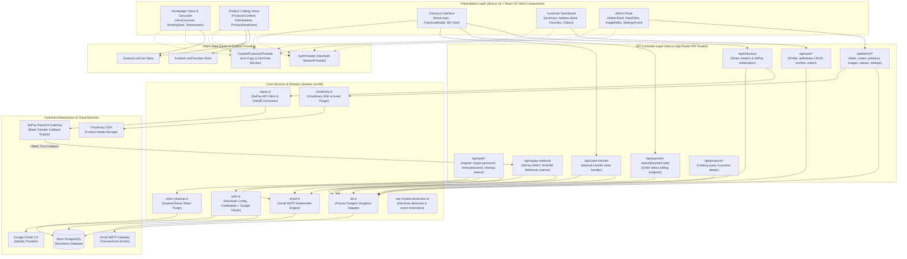

```mermaid
graph TB
    subgraph Client_Presentation ["Presentation Layer (Next.js 16 + React 19 Client Components)"]
        UI_Home["Homepage Views & Carousels<br/>(HeroCarousel, MonthlyDeal, Testimonials)"]
        UI_Catalog["Product Catalog Views<br/>(ProductsContent, FilterSidebar, ProductDetailView)"]
        UI_Checkout["Checkout Interface<br/>(thanh-toan, CheckoutModal, QR View)"]
        UI_Account["Customer Dashboard<br/>(tai-khoan, Address Book, Favorites, Orders)"]
        UI_Admin["Admin Panel<br/>(AdminShell, DataTable, ImageEditor, SettingsForm)"]
    end

    subgraph Client_State ["Client State Stores & Context Providers"]
        Zustand_Cart["Zustand useCart Store"]
        Zustand_Fav["Zustand useFavorites Store"]
        AuthProvider["AuthProvider (NextAuth SessionProvider)"]
        ProtProvider["ContentProtectionProvider (Anti-Copy & DevTools Blocker)"]
    end

    subgraph API_Layer ["API Controller Layer (Next.js App Router API Routes)"]
        API_Auth["/api/auth/*<br/>(register, forgot-password, reset-password, cleanup-tokens)"]
        API_Checkout["/api/checkout<br/>(Order creation & SePay initialization)"]
        API_Payment["/api/payment-status/[transferCode]<br/>(Order status polling endpoint)"]
        API_Webhook["/api/sepay-webhook<br/>(SePay HMAC SHA256 Webhook Listener)"]
        API_Claim["/api/claim-transfer<br/>(Manual transfer claim handler)"]
        API_Products["/api/products/*<br/>(Catalog query & product details)"]
        API_User["/api/user/*<br/>(Profile, addresses CRUD, wishlist, orders)"]
        API_Admin["/api/admin/*<br/>(Stats, orders, products, images, upload, settings)"]
    end

    subgraph Core_Services ["Core Services & Domain Libraries (src/lib)"]
        Lib_Auth["auth.ts<br/>(NextAuth Config, Credentials + Google OAuth)"]
        Lib_DB["db.ts<br/>(Prisma Postgres Singleton Adapter)"]
        Lib_SePay["sepay.ts<br/>(SePay API Client & VietQR Generator)"]
        Lib_Email["email.ts<br/>(Gmail SMTP Nodemailer Engine)"]
        Lib_Cloudinary["cloudinary.ts<br/>(Cloudinary SDK & Asset Purger)"]
        Lib_Cleanup["token-cleanup.ts<br/>(Expired Reset Token Purge)"]
        Lib_Protection["use-content-protection.ts<br/>(DevTools detection & event restrictions)"]
    end

    subgraph External_Infrastructure ["External Infrastructure & Cloud Services"]
        DB_Neon[("Neon PostgreSQL<br/>Serverless Database")]
        GW_SePay["SePay Payment Gateway<br/>(Bank Transfer Callback Engine)"]
        Cloud_Cloudinary["Cloudinary CDN<br/>(Product Media Storage)"]
        SMTP_Gmail["Gmail SMTP Gateway<br/>(Transactional Emails)"]
        OAuth_Google["Google OAuth 2.0<br/>(Identity Provider)"]
    end

    %% UI Connections
    UI_Home --> Zustand_Cart
    UI_Catalog --> Zustand_Cart
    UI_Catalog --> Zustand_Fav
    UI_Checkout --> API_Checkout
    UI_Checkout --> API_Payment
    UI_Checkout --> API_Claim
    UI_Account --> API_User
    UI_Admin --> API_Admin
    UI_Home & UI_Catalog & UI_Checkout & UI_Account & UI_Admin -.-> AuthProvider
    UI_Home & UI_Catalog & UI_Checkout & UI_Account & UI_Admin -.-> ProtProvider

    %% API Layer Connections
    API_Auth --> Lib_Auth
    API_Auth --> Lib_Email
    API_Auth --> Lib_Cleanup
    API_Checkout --> Lib_SePay
    API_Checkout --> Lib_DB
    API_Payment --> Lib_DB
    API_Webhook --> Lib_DB
    API_Webhook --> Lib_Email
    API_Claim --> Lib_DB
    API_Claim --> Lib_Email
    API_Products --> Lib_DB
    API_User --> Lib_DB
    API_Admin --> Lib_DB
    API_Admin --> Lib_Cloudinary

    %% Core Services Connections
    Lib_Auth --> DB_Neon
    Lib_Auth --> OAuth_Google
    Lib_DB --> DB_Neon
    Lib_SePay --> GW_SePay
    Lib_Email --> SMTP_Gmail
    Lib_Cloudinary --> Cloud_Cloudinary
    Lib_Cleanup --> DB_Neon
    GW_SePay -- "HMAC Post Callback" --> API_Webhook
```
