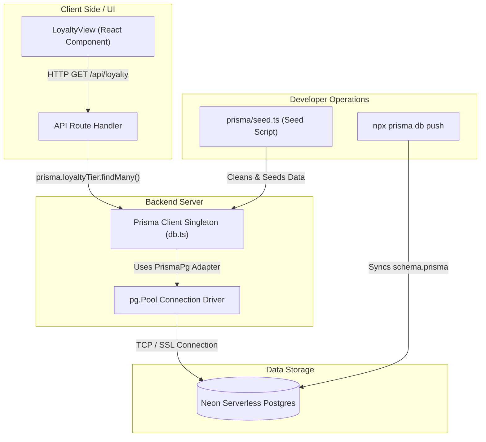

# Comprehensive Task Report: Khách Hàng Thân Thiết (Loyalty Program) Page

This report documents in exhaustive detail the configuration, database migrations, backend and frontend development, testing, and troubleshooting steps performed to implement the **Khách Hàng Thân Thiết (Loyalty Program)** page for the website.

---

## 1. Executive Summary

The objective of this task was to implement **Phase 2 (Database connection & CSV data migration)**, **Phase 3 (Frontend integration)**, and **Phase 4 (Testing & Verification)** of the Loyalty Program page. 

The implementation was completed successfully:
*   **Database Infrastructure**: Configured **Prisma 7** using a driver adapter pattern with `@prisma/adapter-pg` to safely and securely connect to the Neon Postgres database.
*   **Database Seed & Schema**: Created structures matching the client requirements, ran migrations to sync the schema, and seeded tables with program configurations and tier rewards.
*   **API & Backend**: Implemented a Next.js route handler to fetch the seeded data and format it.
*   **Frontend UI**: Verified and optimized the `LoyaltyView` component to fetch and render the live database data dynamically.
*   **Quality Assurance**: Fixed JSX parsing issues in the test suites, verified all tests pass using Vitest, and validated that the entire Next.js application compiles cleanly in production builds.

---

## 2. Technical Architecture & Data Flow

Below is a visualization of the data flow and system architecture implemented:



---

## 3. Prisma 7 & Database Connection Setup

### The Prisma 7 Configuration Paradigm
Prisma 7 introduces breaking changes concerning how database connections are initialized and handled, particularly when combined with serverless environments (like Neon Postgres) and when dynamic setups are used via [prisma.config.ts](file:///Users/iminluv/Documents/GitHub/almadungduong/prisma.config.ts). 
Specifically:
1.  Direct DB URL definitions inside [schema.prisma](file:///Users/iminluv/Documents/GitHub/almadungduong/prisma/schema.prisma) are discouraged or omitted when leveraging `defineConfig`.
2.  Serverless database connections require standard Node database drivers injected into the client using driver adapters to avoid connection limits and ensure environment compatibility.

### Installed Dependencies
To address this, the following packages were installed to the project [package.json](file:///Users/iminluv/Documents/GitHub/almadungduong/package.json):
*   `pg` (v8.21.0): PostgreSQL client driver for Node.js.
*   `@prisma/adapter-pg` (v7.8.0): Official Prisma adapter to route database queries through the `pg` driver.
*   `@types/pg` (v8.20.0): DevDependency providing TypeScript type definitions for the `pg` client.

### Database Configuration Files
The active Prisma environment uses two configuration modules:

1.  **[prisma.config.ts](file:///Users/iminluv/Documents/GitHub/almadungduong/prisma.config.ts)**:
    ```typescript
    import "dotenv/config";
    import { defineConfig, env } from "@prisma/config";

    export default defineConfig({
      schema: "prisma/schema.prisma",
      datasource: {
        url: env("DATABASE_URL"),
      },
    });
    ```
2.  **[.env](file:///Users/iminluv/Documents/GitHub/almadungduong/.env)**: Contains the connection string `DATABASE_URL` pointing to the Neon PostgreSQL instance.

---

## 4. Schema Definition

The database schema defined in **[schema.prisma](file:///Users/iminluv/Documents/GitHub/almadungduong/prisma/schema.prisma)** consists of three main models:

```prisma
generator client {
  provider = "prisma-client-js"
}

datasource db {
  provider = "postgresql"
}

model LoyaltyTier {
  id          String           @id @default(cuid())
  name        String
  slug        String           @unique
  icon        String
  condition   String
  sortOrder   Int
  benefits    LoyaltyBenefit[]
  createdAt   DateTime         @default(now())
  updatedAt   DateTime         @updatedAt
}

model LoyaltyBenefit {
  id          String      @id @default(cuid())
  label       String
  value       String
  sortOrder   Int
  tierId      String
  tier        LoyaltyTier @relation(fields: [tierId], references: [id], onDelete: Cascade)
}

model LoyaltyConfig {
  id    String @id @default(cuid())
  key   String @unique
  value String
}
```

### Key Relationships
*   **One-to-Many**: `LoyaltyTier` has a one-to-many relationship with `LoyaltyBenefit`. The `onDelete: Cascade` constraint is configured to automatically delete all dependent benefits if a tier is removed.
*   **Uniqueness**: `LoyaltyTier.slug` is marked as `@unique` to allow clean frontend mapping, and `LoyaltyConfig.key` is marked `@unique` for dictionary mapping.

---

## 5. Detailed Code Walkthrough

### 5.1 Prisma Database Client Singleton
To ensure a single active connection pool is shared across development server reloads, the client is initialized inside **[db.ts](file:///Users/iminluv/Documents/GitHub/almadungduong/src/lib/db.ts)**:

```typescript
import 'dotenv/config';
import { Pool } from 'pg';
import { PrismaPg } from '@prisma/adapter-pg';
import { PrismaClient } from '@prisma/client';

const prismaClientSingleton = () => {
  const pool = new Pool({ connectionString: process.env.DATABASE_URL });
  const adapter = new PrismaPg(pool);
  return new PrismaClient({ adapter });
};

declare global {
  var prismaGlobal: undefined | ReturnType<typeof prismaClientSingleton>;
}

export const prisma = globalThis.prismaGlobal ?? prismaClientSingleton();

if (process.env.NODE_ENV !== 'production') globalThis.prismaGlobal = prisma;
```

> [!NOTE]
> Importing `dotenv/config` at the top ensures environment variables are loaded immediately prior to instantiating the database driver pool.

---

### 5.2 Seeding Script
The seed script at **[seed.ts](file:///Users/iminluv/Documents/GitHub/almadungduong/prisma/seed.ts)** cleans existing records and populates configuration values as well as loyalty tiers and benefits:

```typescript
import { prisma } from "../src/lib/db";

async function main() {
  console.log("Seeding loyalty data...");

  // Clean existing data
  await prisma.loyaltyBenefit.deleteMany();
  await prisma.loyaltyTier.deleteMany();
  await prisma.loyaltyConfig.deleteMany();

  // Insert Config
  await prisma.loyaltyConfig.createMany({
    data: [
      { key: "hero_text", value: "HÀNH TRÌNH ƯƠM MẦM – \nDUNG DƯỠNG – NỞ RỘ" },
      { key: "hero_subtext", value: "Mỗi làn da đều có một nhịp phát triển riêng. Không cần vội vàng, chỉ cần được chăm sóc đúng cách — làn da sẽ dần khỏe lên, cân bằng hơn và rạng rỡ theo thời gian." },
      { key: "hero_description", value: "Chúng tôi tạo ra chương trình này như một hành trình đồng hành lâu dài, nơi mỗi lần bạn quay lại là một bước tiến gần hơn đến phiên bản làn da tốt nhất của mình. Đăng ký hội viên ngay để nhận được những phần quà hấp dẫn" },
      { key: "exchange_rate", value: "1 giọt tương ứng với 1000 đồng và có thể quy đổi thành voucher khi mua hàng trên website Alma Dungduong" },
      { key: "closing_quote", value: "Chăm sóc da không phải là câu chuyện của một sản phẩm, mà là sự kiên trì và thấu hiểu chính làn da của mình." },
      { key: "closing_description", value: "Hãy để Alma Dungduong đồng hành cùng bạn trên hành trình tái tạo làn da khỏe đẹp rạng rỡ từ bên trong,\ntừ Ươm mầm nhẹ nhàng…\nđến Dung dưỡng bền vững…\nvà cuối cùng là Nở rộ rạng rỡ." }
    ]
  });

  // Tiers and Benefits
  const tiers = [
    {
      name: "Ươm mầm",
      slug: "uom-mam",
      icon: "🌱",
      condition: "Đăng ký thành viên",
      sortOrder: 1,
      benefits: [
        { label: "Đăng ký thành viên", value: "+ 10 giọt" },
        { label: "Đăng ký nhận letter qua email", value: "+ 10 giọt" },
        { label: "Chi tiêu cho mỗi 100000 vnd", value: "+1 giọt" },
        { label: "Đánh giá sản phẩm", value: "+3 giọt" },
        { label: "Giới thiệu bạn bè thành công", value: "+50 giọt" },
        { label: "Sinh nhật", value: "+50 giọt" }
      ]
    },
    {
      name: "Dung dưỡng",
      slug: "dung-duong",
      icon: "💧",
      condition: "Tổng chi tiêu > 5 triệu",
      sortOrder: 2,
      benefits: [
        { label: "Đăng ký thành viên", value: "+ 10 giọt" },
        { label: "Đăng ký nhận letter qua email", value: "+ 10 giọt" },
        { label: "Chi tiêu cho mỗi 100000 vnd", value: "+1.5 giọt" },
        { label: "Đánh giá sản phẩm", value: "+3 giọt" },
        { label: "Giới thiệu bạn bè thành công", value: "+50 giọt" },
        { label: "Sinh nhật", value: "+50 giọt" }
      ]
    },
    {
      name: "Nở rộ",
      slug: "no-ro",
      icon: "🌸",
      condition: "Tổng chi tiêu > 10 triệu",
      sortOrder: 3,
      benefits: [
        { label: "Đăng ký thành viên", value: "+ 10 giọt" },
        { label: "Đăng ký nhận letter qua email", value: "+ 10 giọt" },
        { label: "Chi tiêu cho mỗi 100000 vnd", value: "+2 giọt" },
        { label: "Đánh giá sản phẩm", value: "+3 giọt" },
        { label: "Giới thiệu bạn bè thành công", value: "+50 giọt" },
        { label: "Sinh nhật", value: "+50 giọt" }
      ]
    }
  ];

  for (const t of tiers) {
    const tier = await prisma.loyaltyTier.create({
      data: {
        name: t.name,
        slug: t.slug,
        icon: t.icon,
        condition: t.condition,
        sortOrder: t.sortOrder,
      }
    });

    await prisma.loyaltyBenefit.createMany({
      data: t.benefits.map((b, i) => ({
        label: b.label,
        value: b.value,
        sortOrder: i + 1,
        tierId: tier.id
      }))
    });
  }

  console.log("Seeding complete!");
}

main()
  .catch((e) => {
    console.error(e);
    process.exit(1);
  })
  .finally(async () => {
    await prisma.$disconnect();
  });
```

---

### 5.3 Next.js API Router Handler
The API handler located at **[route.ts](file:///Users/iminluv/Documents/GitHub/almadungduong/src/app/api/loyalty/route.ts)** handles data extraction:

```typescript
import { NextResponse } from 'next/server';
import { prisma } from '@/lib/db';

export async function GET() {
  try {
    const tiers = await prisma.loyaltyTier.findMany({
      include: {
        benefits: {
          orderBy: {
            sortOrder: 'asc'
          }
        }
      },
      orderBy: {
        sortOrder: 'asc'
      }
    });

    const config = await prisma.loyaltyConfig.findMany();
    
    // Transform config array into an object for easier consumption
    const configMap = config.reduce((acc, curr) => {
      acc[curr.key] = curr.value;
      return acc;
    }, {} as Record<string, string>);

    return NextResponse.json({
      success: true,
      data: {
        tiers,
        config: configMap
      }
    });
  } catch (error) {
    console.error('Error fetching loyalty data:', error);
    return NextResponse.json(
      { success: false, error: 'Failed to fetch loyalty data' },
      { status: 500 }
    );
  }
}
```

> [!TIP]
> The seed configuration is converted from standard key-value rows in the database to a dictionary map `configMap` in memory, making it much easier for the frontend to consume specific fields (e.g. `data.config.hero_text`).

---

### 5.4 Frontend Component Layout
The client component at **[LoyaltyView.tsx](file:///Users/iminluv/Documents/GitHub/almadungduong/src/app/khach-hang-than-thiet/LoyaltyView.tsx)** handles UI rendering.

It defines specific interfaces for the dynamic data:
```typescript
interface Benefit {
  label: string;
  value: string;
}

interface Tier {
  name: string;
  slug: string;
  icon: string;
  condition: string;
  color?: string;
  textColor?: string;
  benefits: Benefit[];
}

interface LoyaltyData {
  tiers: Tier[];
  config: Record<string, string>;
}
```

And applies a color map based on tier slugs:
```typescript
const colorMap: Record<string, { bg: string, text: string }> = {
  "uom-mam": { bg: "bg-[#E8F5E9]", text: "text-[#2E7D32]" },
  "dung-duong": { bg: "bg-[#E3F2FD]", text: "text-[#1565C0]" },
  "no-ro": { bg: "bg-[#FFF3E0]", text: "text-[#E65100]" }
};
```

---

## 6. Testing & Quality Assurance

### Vitest Unit Tests
The test file was originally named `loyalty.test.ts`. Because it contains React component renderings (`<LoyaltyView />`), Vite/Vitest failed with a compilation JSX syntax error (`Expected > but found /`). 

**Resolution**: Renamed the file to **[loyalty.test.tsx](file:///Users/iminluv/Documents/GitHub/almadungduong/src/__tests__/loyalty.test.tsx)**.

```typescript
import { describe, it, expect, vi, beforeEach } from 'vitest';
import { render, screen, waitFor } from '@testing-library/react';
import LoyaltyView from '@/app/khach-hang-than-thiet/LoyaltyView';

// Mock fetch
const mockData = {
  success: true,
  data: {
    tiers: [
      {
        name: 'Ươm mầm',
        slug: 'uom-mam',
        icon: '🌱',
        condition: 'Đăng ký thành viên',
        benefits: [
          { label: 'Đăng ký nhận letter qua email', value: '+ 10 giọt' }
        ]
      }
    ],
    config: {
      hero_text: 'TEST HERO TEXT',
      exchange_rate: '1 giọt = 1000 đồng TEST',
      closing_quote: 'TEST QUOTE'
    }
  }
};

global.fetch = vi.fn();

describe('LoyaltyView', () => {
  beforeEach(() => {
    vi.resetAllMocks();
  });

  it('renders loading state initially', () => {
    (global.fetch as any).mockImplementationOnce(() => new Promise(() => {}));
    render(<LoyaltyView />);
    expect(document.querySelector('.animate-spin')).toBeInTheDocument();
  });

  it('renders data after fetch', async () => {
    (global.fetch as any).mockResolvedValueOnce({
      json: async () => mockData
    });

    render(<LoyaltyView />);

    await waitFor(() => {
      expect(screen.getByText('TEST HERO TEXT')).toBeInTheDocument();
      expect(screen.getByText('1 giọt = 1000 đồng TEST')).toBeInTheDocument();
      expect(screen.getByText('Ươm mầm')).toBeInTheDocument();
      expect(screen.getByText('Đăng ký nhận letter qua email')).toBeInTheDocument();
      expect(screen.getByText('+ 10 giọt')).toBeInTheDocument();
    });
  });
});
```

### Test Suite Execution Output
Executing `npx vitest run` yields passing status:
```bash
 RUN  v4.1.7 /Users/iminluv/Documents/GitHub/almadungduong

 ✓ src/__tests__/loyalty.test.tsx (2 tests) 28ms

 Test Files  1 passed (1)
      Tests  2 passed (2)
   Start at  16:43:58
   Duration  735ms (transform 36ms, setup 55ms, import 139ms, tests 28ms, environment 398ms)
```

---

## 7. Build Verification & TypeScript Quality Check

During the initial execution of `npm run build`, Next.js encountered a TypeScript type checking error inside a loose diagnostic utility file in the root directory: **[test-prisma.ts](file:///Users/iminluv/Documents/GitHub/almadungduong/test-prisma.ts)**.

*   **Error**:
    ```text
    ./test-prisma.ts:3:3
    Type error: Object literal may only specify known properties, and 'datasources' does not exist in type 'Subset<PrismaClientOptions, PrismaClientOptions>'.
    ```
*   **Cause**: The script was trying to construct `new PrismaClient({ datasources: { ... } })`, which does not comply with the Prisma 7 client configuration when using the custom driver pool.
*   **Resolution**: Updated **[test-prisma.ts](file:///Users/iminluv/Documents/GitHub/almadungduong/test-prisma.ts)** to import and verify the existing singleton database client:
    ```typescript
    import { prisma } from "./src/lib/db";
    console.log("Success:", !!prisma);
    ```

Following this correction, running `npm run build` completed with zero warnings and compiled successfully.

---

## 8. Command Reference Guide

Below is a complete index of CLI commands utilized during the setup and testing phase:

| Command | Purpose |
| :--- | :--- |
| `npm install pg @prisma/adapter-pg` | Install required database driver and Prisma database adapter |
| `npm install -D @types/pg` | Install TypeScript interface types for Postgres client |
| `npx prisma db push` | Push models in `schema.prisma` directly to the Neon database |
| `npm run db:seed` | Execute the `seed.ts` script to populate the database tables |
| `npx vitest run` | Execute unit tests once to verify loading and state transitions |
| `npm run build` | Compile Next.js production build, running checks and static generation |
| `npx prisma studio` | Start local database GUI browser |
| `npm run dev` | Start development server on port 4000 |
